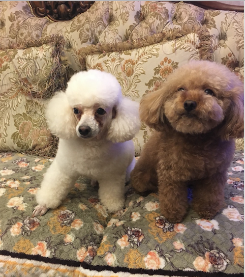

# STAT545 Homework Repository

## Welcome!

This is a repository for STAT545 homeworks. Please comment on my errors if you spot one.

## Table of Contents

| Homework | Contents |
| --- | --- |
| [HW01](https://github.com/qiaoyuet/STAT545-hw-Tang-Qiaoyue/tree/master/hw01) | Initial Setup |
| [HW02](https://github.com/qiaoyuet/STAT545-hw-Tang-Qiaoyue/tree/master/hw02) | Exploration of Gapminder |
| [HW03](https://github.com/qiaoyuet/STAT545-hw-Tang-Qiaoyue/tree/master/hw03) | Dplyr and ggplots |
| [HW04](https://github.com/qiaoyuet/STAT545-hw-Tang-Qiaoyue/tree/master/hw04) | Data reshaping and Joins |
| [HW05](https://github.com/qiaoyuet/STAT545-hw-Tang-Qiaoyue/tree/master/hw05) | Factor Exploration, Wrting Files and Visualization Design |

## Links

- Here is the [homepage](http://stat545.com) of STAT545.
- [hw01](https://github.com/qiaoyuet/STAT545-hw-Tang-Qiaoyue/tree/master/hw01)
    + Create repository
    + Edit README
    + Gapminder exploration in R markdown
- [hw02](https://github.com/qiaoyuet/STAT545-hw-Tang-Qiaoyue/tree/master/hw02)
    + Further exploring gapminder
    + Explore individual variables
    + Explore various of plots
    + dplyr
- [hw03](https://github.com/qiaoyuet/STAT545-hw-Tang-Qiaoyue/tree/master/hw03)
    + Complete specific tasks using dplyr and ggplot
- [hw04](https://github.com/qiaoyuet/STAT545-hw-Tang-Qiaoyue/tree/master/hw04)
    + Data reshaping
    + Join, Merge functions in R
- [hw05](https://github.com/qiaoyuet/STAT545-hw-Tang-Qiaoyue/tree/master/hw05)
    + Explore factors in R
    + Writing in and exporting files from R
    + Wrting figures
    + Visualization design

## About me

- **Qiaoyue Tang**
    - 1st year Msc. Stat at UBC
    - Graduated from UBC last year
- From Nanjing, China
- Loves Science Fictions and Giraffes
- Have two dogs named "water" and "melon" in Chinese

## Picture of Me and My Dogs

## To-Dos

- [x] Fix indentation problem
- [x] Change picture size