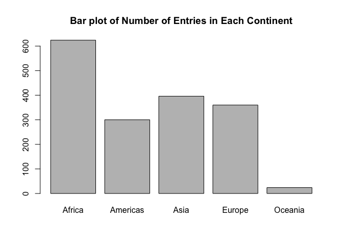
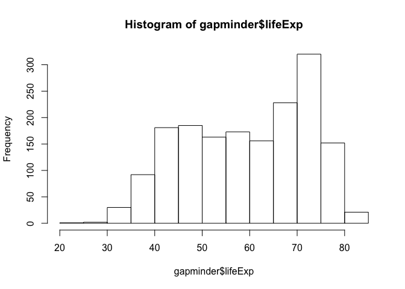
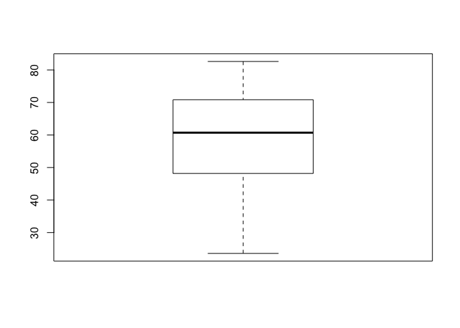
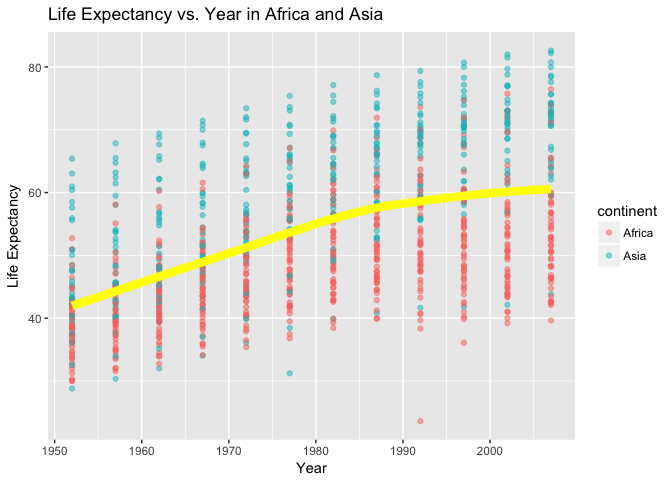
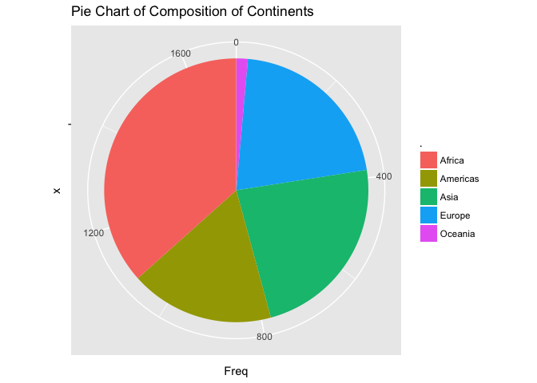
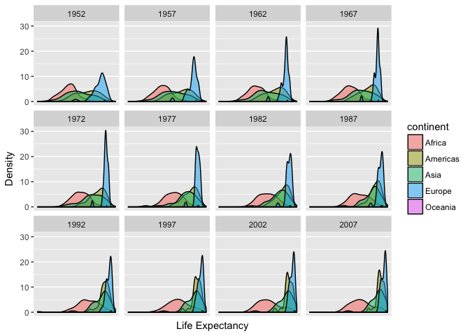
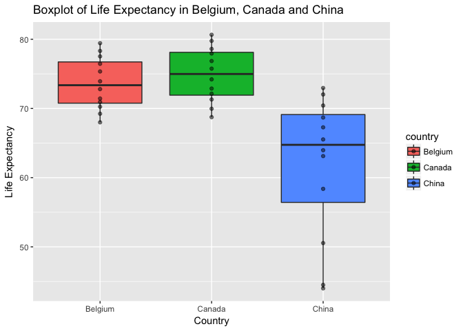
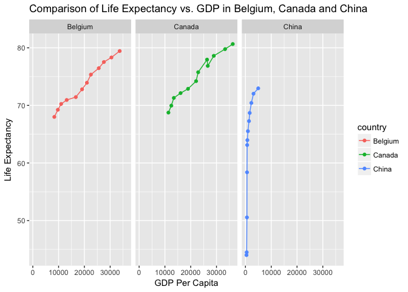

hw02
================
Qiaoyue Tang
2017/9/22

Smell test the data
-------------------

``` r
str(gapminder)
```

    ## Classes 'tbl_df', 'tbl' and 'data.frame':    1704 obs. of  6 variables:
    ##  $ country  : Factor w/ 142 levels "Afghanistan",..: 1 1 1 1 1 1 1 1 1 1 ...
    ##  $ continent: Factor w/ 5 levels "Africa","Americas",..: 3 3 3 3 3 3 3 3 3 3 ...
    ##  $ year     : int  1952 1957 1962 1967 1972 1977 1982 1987 1992 1997 ...
    ##  $ lifeExp  : num  28.8 30.3 32 34 36.1 ...
    ##  $ pop      : int  8425333 9240934 10267083 11537966 13079460 14880372 12881816 13867957 16317921 22227415 ...
    ##  $ gdpPercap: num  779 821 853 836 740 ...

``` r
typeof(gapminder)
```

    ## [1] "list"

-   Is it a data.frame, a matrix, a vector, a list?
-   Gapminder dataset is a tibble, a data.frame and a list.

``` r
class(gapminder)
```

    ## [1] "tbl_df"     "tbl"        "data.frame"

-   What’s its class?
-   Gapminder belongs to the class of tibble and dataframe.

``` r
ncol(gapminder)
```

    ## [1] 6

``` r
nrow(gapminder)
```

    ## [1] 1704

``` r
dim(gapminder)
```

    ## [1] 1704    6

``` r
head(gapminder)
```

    ## # A tibble: 6 x 6
    ##       country continent  year lifeExp      pop gdpPercap
    ##        <fctr>    <fctr> <int>   <dbl>    <int>     <dbl>
    ## 1 Afghanistan      Asia  1952  28.801  8425333  779.4453
    ## 2 Afghanistan      Asia  1957  30.332  9240934  820.8530
    ## 3 Afghanistan      Asia  1962  31.997 10267083  853.1007
    ## 4 Afghanistan      Asia  1967  34.020 11537966  836.1971
    ## 5 Afghanistan      Asia  1972  36.088 13079460  739.9811
    ## 6 Afghanistan      Asia  1977  38.438 14880372  786.1134

``` r
str(gapminder)
```

    ## Classes 'tbl_df', 'tbl' and 'data.frame':    1704 obs. of  6 variables:
    ##  $ country  : Factor w/ 142 levels "Afghanistan",..: 1 1 1 1 1 1 1 1 1 1 ...
    ##  $ continent: Factor w/ 5 levels "Africa","Americas",..: 3 3 3 3 3 3 3 3 3 3 ...
    ##  $ year     : int  1952 1957 1962 1967 1972 1977 1982 1987 1992 1997 ...
    ##  $ lifeExp  : num  28.8 30.3 32 34 36.1 ...
    ##  $ pop      : int  8425333 9240934 10267083 11537966 13079460 14880372 12881816 13867957 16317921 22227415 ...
    ##  $ gdpPercap: num  779 821 853 836 740 ...

``` r
glimpse(gapminder)
```

    ## Observations: 1,704
    ## Variables: 6
    ## $ country   <fctr> Afghanistan, Afghanistan, Afghanistan, Afghanistan,...
    ## $ continent <fctr> Asia, Asia, Asia, Asia, Asia, Asia, Asia, Asia, Asi...
    ## $ year      <int> 1952, 1957, 1962, 1967, 1972, 1977, 1982, 1987, 1992...
    ## $ lifeExp   <dbl> 28.801, 30.332, 31.997, 34.020, 36.088, 38.438, 39.8...
    ## $ pop       <int> 8425333, 9240934, 10267083, 11537966, 13079460, 1488...
    ## $ gdpPercap <dbl> 779.4453, 820.8530, 853.1007, 836.1971, 739.9811, 78...

-   How many variables/columns?
-   There are 6 columns in gapminder.

-   How many rows/observations?
-   There are 1704 rows in gapminder.

-   Can you get these facts about “extent” or “size” in more than one way? Can you imagine different functions being useful in different contexts?
-   We can also get the size information from the function dim(), ncol(), nrow() which gives the dimension of the dataframe, or use head() or tail() to see what the dataframe actually looks like and count. str() and glimpse() would also give information on number of variables etc.

``` r
sapply(gapminder, typeof)
```

    ##   country continent      year   lifeExp       pop gdpPercap 
    ## "integer" "integer" "integer"  "double" "integer"  "double"

-   What data type is each variable?
-   LifeExp and gdpPercap are of type double, and the other variables are of type integer. It is quite surprising that country and continent are of type integer instead of character.

Explore Individual Variables
----------------------------

### Continent

``` r
levels(gapminder$continent)
```

    ## [1] "Africa"   "Americas" "Asia"     "Europe"   "Oceania"

``` r
table(gapminder$continent)
```

    ## 
    ##   Africa Americas     Asia   Europe  Oceania 
    ##      624      300      396      360       24

``` r
barplot(table(gapminder$continent), main = "Bar plot of Number of Entries in Each Continent")
```



-   Continent is a categorical variable and belongs to the class of factor.
-   There are 5 levels in Continent: "Africa", "Americas", "Asia","Europe" and "Oceania". R seems to organize the levels in alphabetical order.
-   From the table() function, we can see that "Africa" appears the most often and "Oceania" appears the least often. The bar graph visualizes the counts.

### Life Expectancy

``` r
hist(gapminder$lifeExp)
```



``` r
summary(gapminder$lifeExp)
```

    ##    Min. 1st Qu.  Median    Mean 3rd Qu.    Max. 
    ##   23.60   48.20   60.71   59.47   70.85   82.60

``` r
sd(gapminder$lifeExp)
```

    ## [1] 12.91711

``` r
boxplot(gapminder$lifeExp)
```



-   LifeExp is an quantitive and also contineous variable and is of type number.
-   From the histogram of lifeExp we can see that most values belongs to the range of (70,75). The spread is approximately normal but a bit left skewed.
-   From the summary we can see that the minimum value is 23.60 years and the maximum value is 82.60 with a standard deviation of 12.9. So the data is quite spead out but 50% of them are between values of 48.20 and 70.85. The spread can also be visualized by boxplot.

Explore Various Plot Types
--------------------------

### Scatterplot of Life Expectancy and Year of Countries in Africa and Asia

``` r
dat1 <- gapminder %>% 
  filter(continent %in% c("Africa", "Asia")) %>% 
  ggplot(aes(x=year, y=lifeExp, color=continent)) + geom_point(alpha = 0.5) + geom_smooth(lwd=3, se = F, method = "loess", color = "yellow") + ggtitle("Life Expectancy vs. Year in Africa and Asia") + labs(x="Year", y="Life Expectancy")
dat1
```



The scatterplot show the change of life expectancy among countries in Africa and Asia over time. The yellow line is the smoothed line that shows the overall trend (loess method implemented, a commonly used sommthing method for time series data). From the scatterplot we can see that overall life expectancy increases as year increases for both continents and the speed of increase is greater before 1990s' than after it. We can also see that in general, countries in Asia has longer life Expectancies than countries in Africa.

There is one outlier around year 1990 with a very low life expectancy.

``` r
dat1 <- gapminder %>% 
  filter(continent %in% c("Africa"))
dat1[which.min(dat1$lifeExp), ]
```

    ## # A tibble: 1 x 6
    ##   country continent  year lifeExp     pop gdpPercap
    ##    <fctr>    <fctr> <int>   <dbl>   <int>     <dbl>
    ## 1  Rwanda    Africa  1992  23.599 7290203  737.0686

Using the code above, we can find that it's the country Rwanda in 1992.

### Pie Chart of Composition of Continents

``` r
dat2 <- gapminder %>% 
  select(continent) %>% 
  table() %>% 
  data.frame()

# Table
dat2
```

    ##          . Freq
    ## 1   Africa  624
    ## 2 Americas  300
    ## 3     Asia  396
    ## 4   Europe  360
    ## 5  Oceania   24

``` r
# Pie chart
ggplot(dat2, aes(x="", y=Freq, fill=.)) + geom_bar(width = 1, stat = "identity") + coord_polar("y", start=0) + ggtitle("Pie Chart of Composition of Continents")
```



From the pie chart we can easily see how many data come from which part of the continent. We may observe that most data entries come from Africa, followed by Asia and Europe. It provides a better visualization than just the table.

### Density Plot of Comparing Life Expectancy among Continents

``` r
ggplot(gapminder, aes(x=lifeExp, fill=continent)) + geom_density(alpha=0.5) + facet_wrap(~year) + scale_x_log10() + labs(y="Density", x="Life Expectancy")
```



From the density plot we can easily see changes of life expectancy for each continent over time. It seems that Europe almost always has the highest average of life Expectancy since the blue shades are almost always on the far right end. We can also see that Asia seems to change a lot from the start 1967 to the end of 1982 as the peak of green shades shifts rightward.

### Boxplot and Line Graph Comparing Variables among A Specific Group of Countries

``` r
dat3 <- gapminder %>% 
  filter(country %in% c("Canada","China","Belgium")) %>% 
  select(country, lifeExp, year)

ggplot(dat3, aes(x=country, y=lifeExp, fill=country)) + geom_boxplot() + ggtitle("Boxplot of Life Expectancy in Belgium, Canada and China") + geom_point(alpha=0.5) + labs(x="Country", y="Life Expectancy")
```



We are interested to compare life expectancy of three specific countries. After filter the dataset, we do a boxplot that shows the average and spread of life expectancy for these countries. From the boxplot we can see that the highest value appears in Canada while the lowest value appear in China. China has the largest spread probably due to its large population. The spread of Belgium and Canada are approximately equal while Canada has higher median.

``` r
dat4 <- gapminder %>% 
  select(country, gdpPercap, year)

dat5 <- inner_join(dat3,dat4, by = c("country", "year"))

ggplot(dat5, aes(x=gdpPercap,y=lifeExp, colour=country)) + geom_point() + geom_line() + facet_wrap(~country) + ggtitle("Comparison of Life Expectancy vs. GDP in Belgium, Canada and China") + labs(x="GDP Per Capita", y="Life Expectancy")
```



From the above graph we are able to see a positive relationship between life expectancy and GDP and compare among these three countries. We can see that Belgium and Canada have similar ratios while China is the one that has a dramatic increase in life expectancy without a corresponding rapid increase in GDP.

Extra Question
--------------

``` r
filter(gapminder, country == c("Rwanda", "Afghanistan"))
```

    ## # A tibble: 12 x 6
    ##        country continent  year lifeExp      pop gdpPercap
    ##         <fctr>    <fctr> <int>   <dbl>    <int>     <dbl>
    ##  1 Afghanistan      Asia  1957  30.332  9240934  820.8530
    ##  2 Afghanistan      Asia  1967  34.020 11537966  836.1971
    ##  3 Afghanistan      Asia  1977  38.438 14880372  786.1134
    ##  4 Afghanistan      Asia  1987  40.822 13867957  852.3959
    ##  5 Afghanistan      Asia  1997  41.763 22227415  635.3414
    ##  6 Afghanistan      Asia  2007  43.828 31889923  974.5803
    ##  7      Rwanda    Africa  1952  40.000  2534927  493.3239
    ##  8      Rwanda    Africa  1962  43.000  3051242  597.4731
    ##  9      Rwanda    Africa  1972  44.600  3992121  590.5807
    ## 10      Rwanda    Africa  1982  46.218  5507565  881.5706
    ## 11      Rwanda    Africa  1992  23.599  7290203  737.0686
    ## 12      Rwanda    Africa  2002  43.413  7852401  785.6538

A problem with the above code is that country has only the length of one string, but this code asks for a double-string. So R would find a row that has country equals to "Rwanda", if it finds it, it will try to search for the next one that has country equals to "Afghnistan". So it skips the some of the values. In fact it misses exactly half of the values.

A correct way to do this would be below:

``` r
filter(gapminder, country == c("Rwanda") | country == "Afghanistan")
```

    ## # A tibble: 24 x 6
    ##        country continent  year lifeExp      pop gdpPercap
    ##         <fctr>    <fctr> <int>   <dbl>    <int>     <dbl>
    ##  1 Afghanistan      Asia  1952  28.801  8425333  779.4453
    ##  2 Afghanistan      Asia  1957  30.332  9240934  820.8530
    ##  3 Afghanistan      Asia  1962  31.997 10267083  853.1007
    ##  4 Afghanistan      Asia  1967  34.020 11537966  836.1971
    ##  5 Afghanistan      Asia  1972  36.088 13079460  739.9811
    ##  6 Afghanistan      Asia  1977  38.438 14880372  786.1134
    ##  7 Afghanistan      Asia  1982  39.854 12881816  978.0114
    ##  8 Afghanistan      Asia  1987  40.822 13867957  852.3959
    ##  9 Afghanistan      Asia  1992  41.674 16317921  649.3414
    ## 10 Afghanistan      Asia  1997  41.763 22227415  635.3414
    ## # ... with 14 more rows

To make this into a nice table:

``` r
dat_test <- filter(gapminder, country == c("Rwanda") | country == "Afghanistan")
library(knitr)
kable(dat_test, format = "markdown", col.names = c("Country", "Continent", "Year", "Life Expectancy", "Population", "GDP per Capita"), align = "c")
```

|   Country   | Continent | Year | Life Expectancy | Population | GDP per Capita |
|:-----------:|:---------:|:----:|:---------------:|:----------:|:--------------:|
| Afghanistan |    Asia   | 1952 |      28.801     |   8425333  |    779.4453    |
| Afghanistan |    Asia   | 1957 |      30.332     |   9240934  |    820.8530    |
| Afghanistan |    Asia   | 1962 |      31.997     |  10267083  |    853.1007    |
| Afghanistan |    Asia   | 1967 |      34.020     |  11537966  |    836.1971    |
| Afghanistan |    Asia   | 1972 |      36.088     |  13079460  |    739.9811    |
| Afghanistan |    Asia   | 1977 |      38.438     |  14880372  |    786.1134    |
| Afghanistan |    Asia   | 1982 |      39.854     |  12881816  |    978.0114    |
| Afghanistan |    Asia   | 1987 |      40.822     |  13867957  |    852.3959    |
| Afghanistan |    Asia   | 1992 |      41.674     |  16317921  |    649.3414    |
| Afghanistan |    Asia   | 1997 |      41.763     |  22227415  |    635.3414    |
| Afghanistan |    Asia   | 2002 |      42.129     |  25268405  |    726.7341    |
| Afghanistan |    Asia   | 2007 |      43.828     |  31889923  |    974.5803    |
|    Rwanda   |   Africa  | 1952 |      40.000     |   2534927  |    493.3239    |
|    Rwanda   |   Africa  | 1957 |      41.500     |   2822082  |    540.2894    |
|    Rwanda   |   Africa  | 1962 |      43.000     |   3051242  |    597.4731    |
|    Rwanda   |   Africa  | 1967 |      44.100     |   3451079  |    510.9637    |
|    Rwanda   |   Africa  | 1972 |      44.600     |   3992121  |    590.5807    |
|    Rwanda   |   Africa  | 1977 |      45.000     |   4657072  |    670.0806    |
|    Rwanda   |   Africa  | 1982 |      46.218     |   5507565  |    881.5706    |
|    Rwanda   |   Africa  | 1987 |      44.020     |   6349365  |    847.9912    |
|    Rwanda   |   Africa  | 1992 |      23.599     |   7290203  |    737.0686    |
|    Rwanda   |   Africa  | 1997 |      36.087     |   7212583  |    589.9445    |
|    Rwanda   |   Africa  | 2002 |      43.413     |   7852401  |    785.6538    |
|    Rwanda   |   Africa  | 2007 |      46.242     |   8860588  |    863.0885    |

To practice other dplyr functions:

``` r
gapminder %>% 
    filter(country %in% c("Canada", "Algeria"), 
           year <= 1969, year >= 1960) %>% 
    select(country, year, gdpPercap, pop) %>% 
  arrange(year, gdpPercap) %>%
  mutate(GDP = gdpPercap * pop)
```

    ## # A tibble: 4 x 5
    ##   country  year gdpPercap      pop          GDP
    ##    <fctr> <int>     <dbl>    <int>        <dbl>
    ## 1 Algeria  1962  2550.817 11000948  28061403854
    ## 2  Canada  1962 13462.486 18985849 255596717817
    ## 3 Algeria  1967  3246.992 12760499  41433235247
    ## 4  Canada  1967 16076.588 20819767 334710816940
