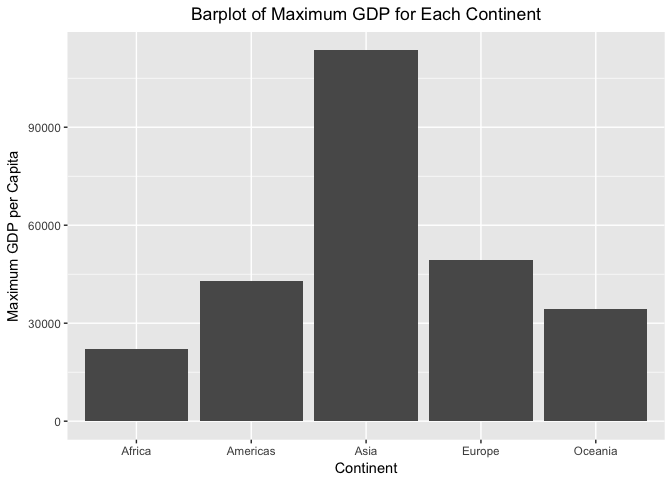
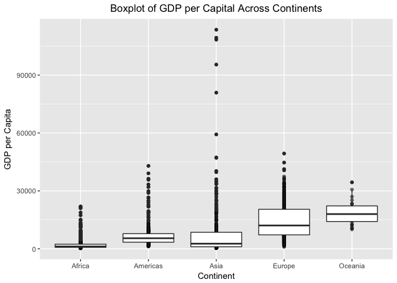
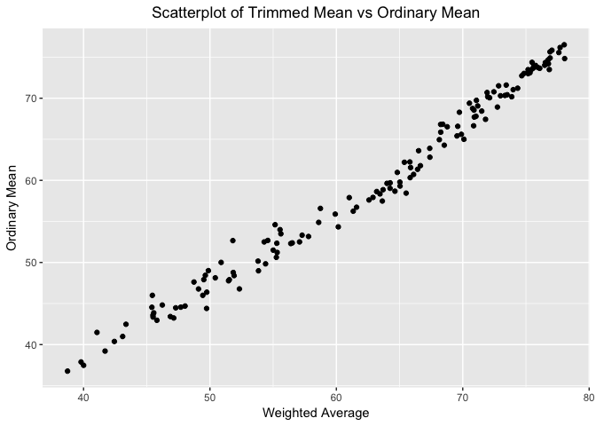
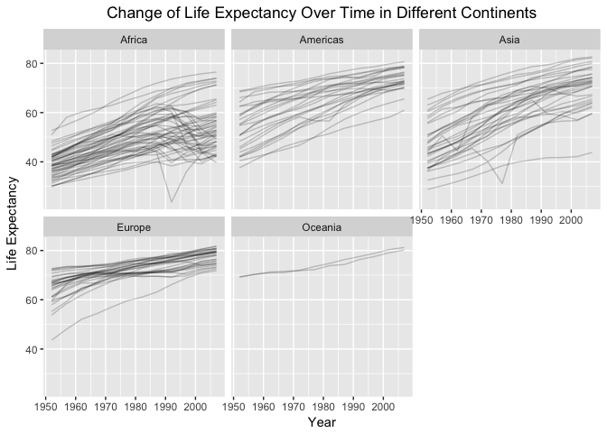

hw03
================
Qiaoyue Tang
2017/9/30

### Task 1: Get the maximum and minimum of GDP per capita for all continents.

``` r
dat1 <- gapminder %>%
  group_by(continent) %>% 
  summarize(max_gdp=max(gdpPercap), min_gdp=min(gdpPercap)) %>% 
  mutate(diff=max_gdp-min_gdp)
knitr::kable(dat1)
```

| continent |   max\_gdp|    min\_gdp|       diff|
|:----------|----------:|-----------:|----------:|
| Africa    |   21951.21|    241.1659|   21710.05|
| Americas  |   42951.65|   1201.6372|   41750.02|
| Asia      |  113523.13|    331.0000|  113192.13|
| Europe    |   49357.19|    973.5332|   48383.66|
| Oceania   |   34435.37|  10039.5956|   24395.77|

From the table we can see that the maximun of GDP per Capita over all appears in Asia, and the minimum appears in Africa. I've also included a difference column which tells the difference between the maximum GDP and the minimum GDP. We can see that the largest gap occurs in Asia.

One problem that I hope to solve is to make min\_gdp also with 2 digits of decimals, but since summarize does not have an argument that sets decimal places.

``` r
ggplot(dat1, aes(x=continent, y=max_gdp)) + geom_bar(stat = "identity") + ggtitle("Barplot of Maximum GDP for Each Continent") + theme(plot.title = element_text(hjust = 0.5)) +
              labs(x="Continent", y="Maximum GDP per Capita")
```



The barplot above shows a visualization of the maximum GDP across continents.

### Task 2: Look at the spread of GDP per capita within the continents.

``` r
gapminder %>%
  select(continent, country, year, gdpPercap) %>%
  head(n=20) %>% 
  knitr::kable()
```

| continent | country     |  year|  gdpPercap|
|:----------|:------------|-----:|----------:|
| Asia      | Afghanistan |  1952|   779.4453|
| Asia      | Afghanistan |  1957|   820.8530|
| Asia      | Afghanistan |  1962|   853.1007|
| Asia      | Afghanistan |  1967|   836.1971|
| Asia      | Afghanistan |  1972|   739.9811|
| Asia      | Afghanistan |  1977|   786.1134|
| Asia      | Afghanistan |  1982|   978.0114|
| Asia      | Afghanistan |  1987|   852.3959|
| Asia      | Afghanistan |  1992|   649.3414|
| Asia      | Afghanistan |  1997|   635.3414|
| Asia      | Afghanistan |  2002|   726.7341|
| Asia      | Afghanistan |  2007|   974.5803|
| Europe    | Albania     |  1952|  1601.0561|
| Europe    | Albania     |  1957|  1942.2842|
| Europe    | Albania     |  1962|  2312.8890|
| Europe    | Albania     |  1967|  2760.1969|
| Europe    | Albania     |  1972|  3313.4222|
| Europe    | Albania     |  1977|  3533.0039|
| Europe    | Albania     |  1982|  3630.8807|
| Europe    | Albania     |  1987|  3738.9327|

The above table gives a preview of what information we are looking at, but this is not very efficient because there are too many rows so we need a plot to visualize it.

``` r
gapminder %>%
  select(gdpPercap, continent) %>% 
  ggplot(aes(x=continent, y=gdpPercap)) + 
              geom_point(alpha=0.5) + 
              geom_boxplot() +
              ggtitle("Boxplot of GDP per Capital Across Continents") +
              theme(plot.title = element_text(hjust = 0.5)) +
              labs(x="Continent", y="GDP per Capita")
```



From the boxplot we can see that Asia has the largest variation of GDP per Capita. Even though the middle 50% data are not as variable as Europe, it has a lot more extreme values than the other continents. Oceania seems to have the smallest varaition.

One interesting issue: when I put labs() after theme(), the title alignment is not adjusted. Not sure why this is the case.

### Task 3: Compute a trimmed mean of life expectancy for different years.

``` r
dat3 <- gapminder %>%
  select(country, lifeExp, year) %>% 
  group_by(country) %>% 
  summarise(weighted_lifeExp = weighted.mean(lifeExp, c(1:12)/78))

dat4 <- gapminder %>%
  select(country, lifeExp, year) %>% 
  group_by(country) %>%
  summarize(mean(lifeExp))

dat5<- inner_join(dat3, dat4, by="country")
names(dat5) <- c("Country", "weighted_avg", "mean")
knitr::kable(dat5)
```

| Country                  |  weighted\_avg|      mean|
|:-------------------------|--------------:|---------:|
| Afghanistan              |       40.00268|  37.47883|
| Albania                  |       71.50085|  68.43292|
| Algeria                  |       64.24856|  59.03017|
| Angola                   |       39.80245|  37.88350|
| Argentina                |       71.18441|  69.06042|
| Australia                |       76.75038|  74.66292|
| Austria                  |       75.32151|  73.10325|
| Bahrain                  |       69.89115|  65.60567|
| Bangladesh               |       54.40028|  49.83408|
| Belgium                  |       75.55836|  73.64175|
| Benin                    |       51.84372|  48.77992|
| Bolivia                  |       57.08729|  52.50458|
| Bosnia and Herzegovina   |       70.91392|  67.70783|
| Botswana                 |       55.15363|  54.59750|
| Brazil                   |       65.81532|  62.23950|
| Bulgaria                 |       71.07923|  69.74375|
| Burkina Faso             |       48.03044|  44.69400|
| Burundi                  |       46.23023|  44.81733|
| Cambodia                 |       51.53186|  47.90275|
| Cameroon                 |       50.42151|  48.12850|
| Canada                   |       76.90905|  74.90275|
| Central African Republic |       45.55272|  43.86692|
| Chad                     |       49.09499|  46.77358|
| Chile                    |       71.80199|  67.43092|
| China                    |       66.65003|  61.78514|
| Colombia                 |       67.38796|  63.89775|
| Comoros                  |       56.51033|  52.38175|
| Congo, Dem. Rep.         |       45.40464|  44.54375|
| Congo, Rep.              |       54.29029|  52.50192|
| Costa Rica               |       73.87365|  70.18142|
| Cote d'Ivoire            |       49.63294|  48.43617|
| Croatia                  |       72.12263|  70.05592|
| Cuba                     |       73.98896|  71.04508|
| Czech Republic           |       72.83797|  71.51050|
| Denmark                  |       75.48236|  74.37017|
| Djibouti                 |       49.74862|  46.38075|
| Dominican Republic       |       65.87340|  61.55450|
| Ecuador                  |       67.40065|  62.81683|
| Egypt                    |       61.33467|  56.24300|
| El Salvador              |       64.00713|  59.63333|
| Equatorial Guinea        |       45.80323|  42.96000|
| Eritrea                  |       49.43391|  45.99925|
| Ethiopia                 |       47.29162|  44.47575|
| Finland                  |       75.17290|  72.99192|
| France                   |       76.53518|  74.34892|
| Gabon                    |       55.31555|  51.22050|
| Gambia                   |       49.73399|  44.40058|
| Germany                  |       75.40318|  73.44442|
| Ghana                    |       55.28997|  52.34067|
| Greece                   |       75.95515|  73.73317|
| Guatemala                |       61.59942|  56.72942|
| Guinea                   |       47.13412|  43.23983|
| Guinea-Bissau            |       41.70132|  39.21025|
| Haiti                    |       53.80495|  50.16525|
| Honduras                 |       62.89697|  57.92083|
| Hong Kong, China         |       76.84756|  73.49283|
| Hungary                  |       70.52662|  69.39317|
| Iceland                  |       78.02736|  76.51142|
| India                    |       57.79819|  53.16608|
| Indonesia                |       60.15329|  54.33575|
| Iran                     |       63.18912|  58.63658|
| Iraq                     |       58.73785|  56.58175|
| Ireland                  |       74.84251|  73.01725|
| Israel                   |       76.09431|  73.64583|
| Italy                    |       76.48618|  74.01383|
| Jamaica                  |       70.77878|  68.74933|
| Japan                    |       78.06187|  74.82692|
| Jordan                   |       65.02727|  59.78642|
| Kenya                    |       54.57399|  52.68100|
| Korea, Dem. Rep.         |       66.50791|  63.60733|
| Korea, Rep.              |       70.09217|  65.00100|
| Kuwait                   |       72.74333|  68.92233|
| Lebanon                  |       68.25844|  65.86567|
| Lesotho                  |       50.88310|  50.00708|
| Liberia                  |       43.35619|  42.47625|
| Libya                    |       65.03824|  59.30417|
| Madagascar               |       51.47142|  47.77058|
| Malawi                   |       45.49865|  43.35158|
| Malaysia                 |       68.53771|  64.27958|
| Mali                     |       46.86759|  43.41350|
| Mauritania               |       56.39424|  52.30208|
| Mauritius                |       68.14741|  64.95325|
| Mexico                   |       69.54332|  65.40883|
| Mongolia                 |       59.91164|  55.89033|
| Montenegro               |       72.98501|  70.29917|
| Morocco                  |       62.58150|  57.60883|
| Mozambique               |       42.43728|  40.37950|
| Myanmar                  |       57.29171|  53.32167|
| Namibia                  |       55.61033|  53.49133|
| Nepal                    |       53.83790|  48.98633|
| Netherlands              |       76.90146|  75.64850|
| New Zealand              |       75.75703|  73.98950|
| Nicaragua                |       63.45085|  58.34942|
| Niger                    |       47.69467|  44.55867|
| Nigeria                  |       45.48860|  43.58133|
| Norway                   |       77.05246|  75.84300|
| Oman                     |       65.52097|  58.44267|
| Pakistan                 |       58.60201|  54.88225|
| Panama                   |       71.04867|  67.80175|
| Paraguay                 |       68.25150|  66.80908|
| Peru                     |       63.69656|  58.85933|
| Philippines              |       64.82155|  60.96725|
| Poland                   |       71.97559|  70.17692|
| Portugal                 |       73.51085|  70.41983|
| Puerto Rico              |       74.66960|  72.73933|
| Reunion                  |       70.85982|  66.64425|
| Romania                  |       69.73351|  68.29067|
| Rwanda                   |       41.06146|  41.48158|
| Sao Tome and Principe    |       61.01926|  57.89633|
| Saudi Arabia             |       64.63363|  58.67875|
| Senegal                  |       55.25233|  50.62592|
| Serbia                   |       70.88988|  68.55100|
| Sierra Leone             |       38.73115|  36.76917|
| Singapore                |       74.34504|  71.22025|
| Slovak Republic          |       71.92482|  70.69608|
| Slovenia                 |       73.43888|  71.60075|
| Somalia                  |       43.09309|  40.98867|
| South Africa             |       55.54379|  53.99317|
| Spain                    |       76.77862|  74.20342|
| Sri Lanka                |       68.77095|  66.52608|
| Sudan                    |       51.90927|  48.40050|
| Swaziland                |       49.87394|  49.00242|
| Sweden                   |       77.70100|  76.17700|
| Switzerland              |       77.60221|  75.56508|
| Syria                    |       66.42779|  61.34617|
| Taiwan                   |       73.33641|  70.33667|
| Tanzania                 |       49.51364|  47.91233|
| Thailand                 |       65.38153|  62.20025|
| Togo                     |       55.00585|  51.49875|
| Trinidad and Tobago      |       68.41990|  66.82800|
| Tunisia                  |       66.10956|  60.72100|
| Turkey                   |       64.25445|  59.69642|
| Uganda                   |       48.73337|  47.61883|
| United Kingdom           |       75.62727|  73.92258|
| United States            |       75.16672|  73.47850|
| Uruguay                  |       72.46158|  70.78158|
| Venezuela                |       69.60312|  66.58067|
| Vietnam                  |       63.63597|  57.47950|
| West Bank and Gaza       |       65.83876|  60.32867|
| Yemen, Rep.              |       52.33046|  46.78042|
| Zambia                   |       45.44244|  45.99633|
| Zimbabwe                 |       51.81047|  52.66317|

dat1 provides the trimmed life expectancy and dat2 provides the ordinary mean of life expectancy. I joined them together in one table using inner\_join. The trimmed mean weights are assigned as 1/sum(1:12), 2/sum(1:12), etc. which puts larger weight on later years and smaller weight on previous years. It would make sense in the case where we believe data collection process are getting more precise, so we want the most accurate data to reflect the true mean.

``` r
ggplot(dat5, aes(x=weighted_avg, y=mean)) + geom_point() +
  ggtitle("Scatterplot of Trimmed Mean vs Ordinary Mean") +
              theme(plot.title = element_text(hjust = 0.5)) +
              labs(x="Weighted Average", y="Ordinary Mean")
```



From the scatterplot above we can see that doing the trimmed mean does not deviate a lot from the ordinary mean and they clearly have a strong positive correlation. Therefore we can substitute mean by the trimmed mean if needed without causing too much problem for analysis.

### Task 4: How is life expectancy changing over time on different continents?

``` r
dat6 <- gapminder %>%
  select(country, continent, year, lifeExp) %>% 
  filter(year %in% c(1952,2007)) %>% 
  head(n=20)
knitr::kable(dat6)
```

| country     | continent |  year|  lifeExp|
|:------------|:----------|-----:|--------:|
| Afghanistan | Asia      |  1952|   28.801|
| Afghanistan | Asia      |  2007|   43.828|
| Albania     | Europe    |  1952|   55.230|
| Albania     | Europe    |  2007|   76.423|
| Algeria     | Africa    |  1952|   43.077|
| Algeria     | Africa    |  2007|   72.301|
| Angola      | Africa    |  1952|   30.015|
| Angola      | Africa    |  2007|   42.731|
| Argentina   | Americas  |  1952|   62.485|
| Argentina   | Americas  |  2007|   75.320|
| Australia   | Oceania   |  1952|   69.120|
| Australia   | Oceania   |  2007|   81.235|
| Austria     | Europe    |  1952|   66.800|
| Austria     | Europe    |  2007|   79.829|
| Bahrain     | Asia      |  1952|   50.939|
| Bahrain     | Asia      |  2007|   75.635|
| Bangladesh  | Asia      |  1952|   37.484|
| Bangladesh  | Asia      |  2007|   64.062|
| Belgium     | Europe    |  1952|   68.000|
| Belgium     | Europe    |  2007|   79.441|

The above table shows the life expectancy in the earliest year (1952) and in the last year recorded (2007). Just by observing the first 20 rows we can deduce that most countries would have an upward trend of increasing life expectancy. We'll check it using plots.

``` r
gapminder %>% 
  select(country, continent, year, lifeExp) %>% 
  group_by(country) %>%
  arrange(year) %>% 
  ggplot(aes(x=year, y=lifeExp, group=country)) + geom_path(alpha=0.2) + facet_wrap(~continent) +
         ggtitle("Change of Life Expectancy Over Time in Different Continents") +
              theme(plot.title = element_text(hjust = 0.5)) +
              labs(x="Year", y="Life Expectancy")
```



From the plots we can see that the overall increasing trend is clear for all continents. Even though some countries have a sudden fall in certain periods, there is no obvious trend of decreasing life expectancy at least.
