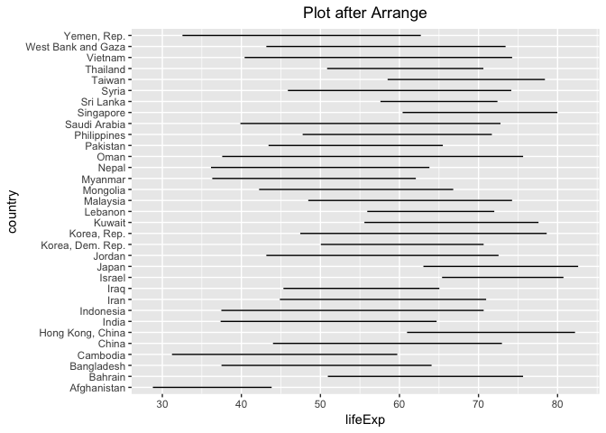
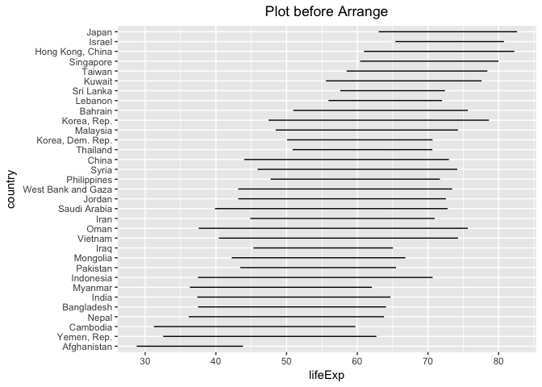
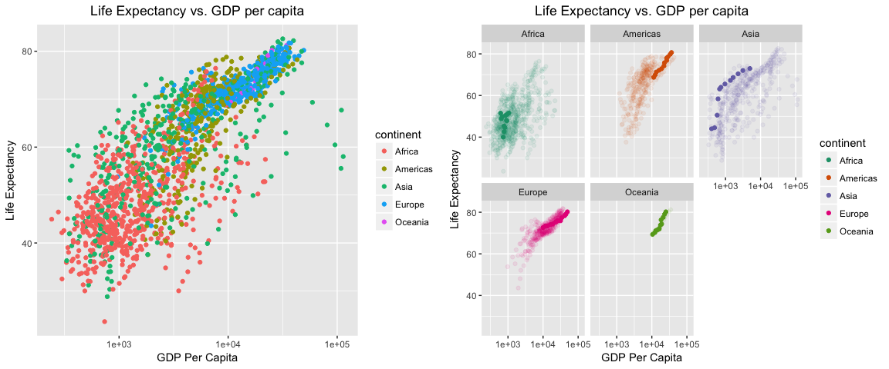
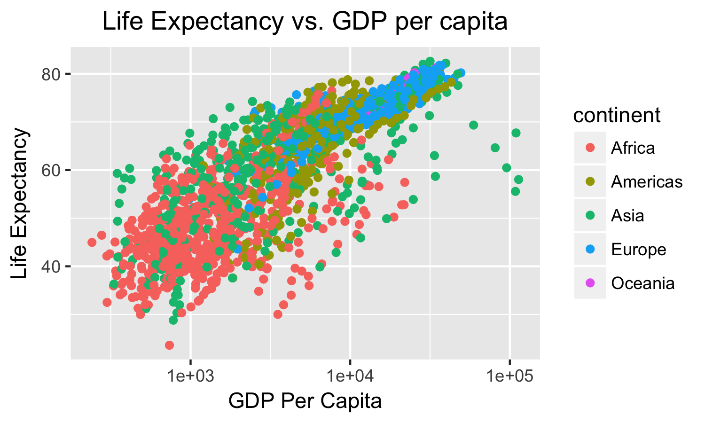

hw05
================
Qiaoyue Tang
2017/10/18

Factor Management
-----------------

dataset: Gapminder

### Drop Oceania

``` r
dat1 <- gapminder %>% 
  filter(continent != c("Oceania")) %>% 
  droplevels()

t.droplevel <- data.frame(nrow(gapminder), nrow(dat1), nlevels(gapminder$continent), nlevels(dat1$continent))
names(t.droplevel) <- c("# rows before drop", "# rows after drop", "# levels before drop", "# levels after drop")
knitr::kable(t.droplevel)
```

|  \# rows before drop|  \# rows after drop|  \# levels before drop|  \# levels after drop|
|--------------------:|-------------------:|----------------------:|---------------------:|
|                 1704|                1680|                      5|                     4|

``` r
gapminder %>% 
  filter(continent == "Oceania") %>% 
  nrow()
```

    ## [1] 24

The gapminder dataset originally have 1704 rows. After drop, the number of rows decrease to 1680, where we checked that there are 24 observations with continent of "Oceania". The numbers match up. After we drop the level of continents, the number of levels change from 5 to 4. The other variables are not affected.

### Reorder Levels

``` r
fct_reorder(dat1$continent, dat1$gdpPercap, fun = max, desc = F) %>% 
  levels()
```

    ## [1] "Africa"   "Americas" "Europe"   "Asia"

The levels of continent are reordered so that the maximum of GDP are in ascending order. We can check if it is indeed in this order by:

``` r
dat1 %>% 
  group_by(continent) %>% 
  summarise(max(gdpPercap))
```

    ## # A tibble: 4 x 2
    ##   continent `max(gdpPercap)`
    ##      <fctr>            <dbl>
    ## 1    Africa         21951.21
    ## 2  Americas         42951.65
    ## 3      Asia        113523.13
    ## 4    Europe         49357.19

So the order should be Africa, Americas, Europe then Asia which is the same as ordered by the previous function.

``` r
fct_reorder(dat1$country, dat1$lifeExp, fun = mean, desc = T) %>% 
  levels() %>% 
  head()
```

    ## [1] "Sierra Leone"  "Afghanistan"   "Angola"        "Guinea-Bissau"
    ## [5] "Mozambique"    "Somalia"

The levels of country are reordered so that the mean of life expectancy are in decending order. Check this by:

``` r
check<- dat1 %>% 
  group_by(country) %>% 
  summarise(mean(lifeExp)) %>% 
  data.frame()
names(check) <- c("country", "mean_lifeExp")
check[with(check, order(mean_lifeExp)), ] %>% 
  head()
```

    ##           country mean_lifeExp
    ## 111  Sierra Leone     36.76917
    ## 1     Afghanistan     37.47883
    ## 4          Angola     37.88350
    ## 52  Guinea-Bissau     39.21025
    ## 86     Mozambique     40.37950
    ## 115       Somalia     40.98867

We can see that the new order is exactly ordered by desending mean of life expectancy. (Here we only look at head to avoid lengthy dataframes.)

### Common Part

Explore the effects of **arrange**

``` r
gapminder_subset<- gapminder %>% 
  filter(continent %in% c("Asia"))

dat2 <- gapminder %>%
  filter(continent %in% c("Asia")) %>% 
  arrange(lifeExp)

head(levels(dat2$country), n=10)
```

    ##  [1] "Afghanistan" "Albania"     "Algeria"     "Angola"      "Argentina"  
    ##  [6] "Australia"   "Austria"     "Bahrain"     "Bangladesh"  "Belgium"

``` r
head(levels(gapminder_subset$country), n=10)
```

    ##  [1] "Afghanistan" "Albania"     "Algeria"     "Angola"      "Argentina"  
    ##  [6] "Australia"   "Austria"     "Bahrain"     "Bangladesh"  "Belgium"

``` r
ggplot(dat2, aes(x=lifeExp, y=country)) + geom_line() + ggtitle("Plot after Arrange") + theme(plot.title = element_text(hjust = 0.5))
```



``` r
ggplot(gapminder_subset, aes(x=lifeExp, y=country)) + geom_line() + ggtitle("Plot before Arrange") + theme(plot.title = element_text(hjust = 0.5))
```


We can see that arrange does not have an effect on the plots, and the levels are the same before and after arrange.

Explore the effects of **reorder and arrange**

``` r
dat2$country <- fct_reorder(dat2$country, dat2$lifeExp, fun = mean, desc = T)

head(levels(dat2$country), n=10)
```

    ##  [1] "Afghanistan" "Yemen, Rep." "Cambodia"    "Nepal"       "Bangladesh" 
    ##  [6] "India"       "Myanmar"     "Indonesia"   "Pakistan"    "Mongolia"

``` r
ggplot(dat2, aes(x=lifeExp, y=country)) + geom_line() + ggtitle("Plot before Arrange") + theme(plot.title = element_text(hjust = 0.5))
```



We can see that the levels are now arranged in the order of decreasing mean of life expectancy, and the graph is changed as well. The plot is now using the reordered levels.

File I/O
--------

### Bring Data in

``` r
gap_tsv <- system.file("gapminder.tsv", package = "gapminder")
gapminder <- read_tsv(gap_tsv)
```

    ## Parsed with column specification:
    ## cols(
    ##   country = col_character(),
    ##   continent = col_character(),
    ##   year = col_integer(),
    ##   lifeExp = col_double(),
    ##   pop = col_integer(),
    ##   gdpPercap = col_double()
    ## )

``` r
str(gapminder, give.attr = FALSE)
```

    ## Classes 'tbl_df', 'tbl' and 'data.frame':    1704 obs. of  6 variables:
    ##  $ country  : chr  "Afghanistan" "Afghanistan" "Afghanistan" "Afghanistan" ...
    ##  $ continent: chr  "Asia" "Asia" "Asia" "Asia" ...
    ##  $ year     : int  1952 1957 1962 1967 1972 1977 1982 1987 1992 1997 ...
    ##  $ lifeExp  : num  28.8 30.3 32 34 36.1 ...
    ##  $ pop      : int  8425333 9240934 10267083 11537966 13079460 14880372 12881816 13867957 16317921 22227415 ...
    ##  $ gdpPercap: num  779 821 853 836 740 ...

We can see that when using readr functions, countries and continents are considered characters instead of factors.

``` r
gapminder_Asia_lifeExp <- gapminder %>%
  mutate(country = factor(country),
         continent = factor(continent)) %>% 
  filter(continent %in% c("Asia")) %>% 
  group_by(country) %>% 
  summarize(mean_lifeExp = mean(lifeExp))
```

Here we compute the mean life expectancies for each country in Asia, and we want to export this dataset.

``` r
write_csv(gapminder_Asia_lifeExp, "gapminder_Asia_lifeExp.csv")
```

[Link to gapminder\_Asia\_lifeExp.csv](https://github.com/qiaoyuet/STAT545-hw-Tang-Qiaoyue/blob/master/hw05/gapminder_Asia_lifeExp.csv)

Testing whether reordering levels survives after reading in and out:

Read the previous dataset back in:

``` r
gapminder_Asia_lifeExp <- read_csv("gapminder_Asia_lifeExp.csv")
```

    ## Parsed with column specification:
    ## cols(
    ##   country = col_character(),
    ##   mean_lifeExp = col_double()
    ## )

``` r
str(gapminder_Asia_lifeExp, give.attr = FALSE)
```

    ## Classes 'tbl_df', 'tbl' and 'data.frame':    33 obs. of  2 variables:
    ##  $ country     : chr  "Afghanistan" "Bahrain" "Bangladesh" "Cambodia" ...
    ##  $ mean_lifeExp: num  37.5 65.6 49.8 47.9 61.8 ...

``` r
gapminder_Asia_lifeExp$country <- as.factor(gapminder_Asia_lifeExp$country)
str(gapminder_Asia_lifeExp, give.attr = FALSE)
```

    ## Classes 'tbl_df', 'tbl' and 'data.frame':    33 obs. of  2 variables:
    ##  $ country     : Factor w/ 33 levels "Afghanistan",..: 1 2 3 4 5 6 7 8 9 10 ...
    ##  $ mean_lifeExp: num  37.5 65.6 49.8 47.9 61.8 ...

``` r
levels(gapminder_Asia_lifeExp$country)
```

    ##  [1] "Afghanistan"        "Bahrain"            "Bangladesh"        
    ##  [4] "Cambodia"           "China"              "Hong Kong, China"  
    ##  [7] "India"              "Indonesia"          "Iran"              
    ## [10] "Iraq"               "Israel"             "Japan"             
    ## [13] "Jordan"             "Korea, Dem. Rep."   "Korea, Rep."       
    ## [16] "Kuwait"             "Lebanon"            "Malaysia"          
    ## [19] "Mongolia"           "Myanmar"            "Nepal"             
    ## [22] "Oman"               "Pakistan"           "Philippines"       
    ## [25] "Saudi Arabia"       "Singapore"          "Sri Lanka"         
    ## [28] "Syria"              "Taiwan"             "Thailand"          
    ## [31] "Vietnam"            "West Bank and Gaza" "Yemen, Rep."

Reorder levels of country by the increasing mean of life expectancies:

``` r
gapminder_Asia_lifeExp$country <- fct_reorder(gapminder_Asia_lifeExp$country, 
                                              gapminder_Asia_lifeExp$mean_lifeExp)
levels(gapminder_Asia_lifeExp$country)
```

    ##  [1] "Afghanistan"        "Yemen, Rep."        "Cambodia"          
    ##  [4] "Nepal"              "Bangladesh"         "India"             
    ##  [7] "Myanmar"            "Indonesia"          "Pakistan"          
    ## [10] "Mongolia"           "Iraq"               "Vietnam"           
    ## [13] "Oman"               "Iran"               "Saudi Arabia"      
    ## [16] "Jordan"             "West Bank and Gaza" "Philippines"       
    ## [19] "Syria"              "China"              "Thailand"          
    ## [22] "Korea, Dem. Rep."   "Malaysia"           "Korea, Rep."       
    ## [25] "Bahrain"            "Lebanon"            "Sri Lanka"         
    ## [28] "Kuwait"             "Taiwan"             "Singapore"         
    ## [31] "Hong Kong, China"   "Israel"             "Japan"

We can see that the levels of countries are now changed. We want to test if the exported dataset is in this order as well:

``` r
write_csv(gapminder_Asia_lifeExp, "gapminder_Asia_lifeExp_reorder.csv")
gap_Asia_lifeExp_reorder_csv <- read_csv("gapminder_Asia_lifeExp_reorder.csv")
```

    ## Parsed with column specification:
    ## cols(
    ##   country = col_character(),
    ##   mean_lifeExp = col_double()
    ## )

``` r
gap_Asia_lifeExp_reorder_csv$country <- as.factor(gap_Asia_lifeExp_reorder_csv$country)
levels(gap_Asia_lifeExp_reorder_csv$country)
```

    ##  [1] "Afghanistan"        "Bahrain"            "Bangladesh"        
    ##  [4] "Cambodia"           "China"              "Hong Kong, China"  
    ##  [7] "India"              "Indonesia"          "Iran"              
    ## [10] "Iraq"               "Israel"             "Japan"             
    ## [13] "Jordan"             "Korea, Dem. Rep."   "Korea, Rep."       
    ## [16] "Kuwait"             "Lebanon"            "Malaysia"          
    ## [19] "Mongolia"           "Myanmar"            "Nepal"             
    ## [22] "Oman"               "Pakistan"           "Philippines"       
    ## [25] "Saudi Arabia"       "Singapore"          "Sri Lanka"         
    ## [28] "Syria"              "Taiwan"             "Thailand"          
    ## [31] "Vietnam"            "West Bank and Gaza" "Yemen, Rep."

The output file seems to not survive the reordering of levels.

``` r
saveRDS(gapminder_Asia_lifeExp, "gapminder_Asia_lifeExp_reorder.rds")
gap_Asia_lifeExp_reorder_rds <- readRDS("gapminder_Asia_lifeExp_reorder.rds")
levels(gap_Asia_lifeExp_reorder_rds$country)
```

    ##  [1] "Afghanistan"        "Yemen, Rep."        "Cambodia"          
    ##  [4] "Nepal"              "Bangladesh"         "India"             
    ##  [7] "Myanmar"            "Indonesia"          "Pakistan"          
    ## [10] "Mongolia"           "Iraq"               "Vietnam"           
    ## [13] "Oman"               "Iran"               "Saudi Arabia"      
    ## [16] "Jordan"             "West Bank and Gaza" "Philippines"       
    ## [19] "Syria"              "China"              "Thailand"          
    ## [22] "Korea, Dem. Rep."   "Malaysia"           "Korea, Rep."       
    ## [25] "Bahrain"            "Lebanon"            "Sri Lanka"         
    ## [28] "Kuwait"             "Taiwan"             "Singapore"         
    ## [31] "Hong Kong, China"   "Israel"             "Japan"

We can see that reordering survives using saveRDS and readRDS.

This code is from [STAT545 File I/O website](http://stat545.com/block026_file-out-in.html) to help see the changes of levels better between csv and rds.

``` r
country_levels <- tibble(original = head(levels(gapminder_Asia_lifeExp$country)))
country_levels <- country_levels %>% 
  mutate(via_csv = head(levels(gap_Asia_lifeExp_reorder_csv$country)),
         via_rds = head(levels(gap_Asia_lifeExp_reorder_rds$country)))
knitr::kable(country_levels)
```

| original    | via\_csv         | via\_rds    |
|:------------|:-----------------|:------------|
| Afghanistan | Afghanistan      | Afghanistan |
| Yemen, Rep. | Bahrain          | Yemen, Rep. |
| Cambodia    | Bangladesh       | Cambodia    |
| Nepal       | Cambodia         | Nepal       |
| Bangladesh  | China            | Bangladesh  |
| India       | Hong Kong, China | India       |

### Visualization Design

This is a previous plot from the very begining of the class:

``` r
p1 <- ggplot(gapminder, aes(x=gdpPercap, y=lifeExp, color=continent)) + 
  geom_point() + 
  scale_x_log10() +
  ggtitle("Life Expectancy vs. GDP per capita") +
  labs(x="GDP Per Capita", y="Life Expectancy") +
  theme(plot.title = element_text(hjust = 0.5))
```

Editted plot:

``` r
p2 <- ggplot(gapminder, aes(x=gdpPercap, y=lifeExp)) + 
  geom_point(aes(color=continent,
                 alpha=country %in% c("Uganda","Canada","China","Norway","New Zealand"))) + 
  scale_x_log10() +
  ggtitle("Life Expectancy vs. GDP per capita") +
  labs(x="GDP Per Capita", y="Life Expectancy") +
  theme(plot.title = element_text(hjust = 0.5)) +
  facet_wrap(~ continent) + 
  scale_colour_brewer(palette="Dark2") +
  scale_alpha_discrete(range=c(0.08, 1),
                         guide=FALSE)
```

Using Multiplot function to juxtapose two plots from this [link](http://stat545.com/block020_multiple-plots-on-a-page.html#use-the-multiplot-function)

``` r
multiplot(p1,p2,cols = 2)
```

    ## Loading required package: grid



What I changed is to 1) facet the different continents in subplots so that the points are not all cramped together, 2) change the color scheme from the default to "Dark2" and 3) marking the specific countries using different alpha transparences. We can now have a better visualization of the overall relationship between life expectancy and gdp in each continent, and we can further look at how a specific country's data stands out in a larger continent group.

### Writing figures to file

``` r
ggsave("modified_plot.pdf")
```

    ## Saving 7 x 5 in image

``` r
ggsave("lifeExp_gdp.pdf", plot = p1, width = 5, height = 5) # vector format
ggsave("lifeExp_gdp.png", plot = p1, width = 5, height = 3, dpi = 300) # raster format
```

The different arguments in ggsave can be adopted to change the plot size and pixels etc. If we do not specify plot=?, it will autimatically save the last plot. If we indicate with plot=p1, then it will save the specific plot produced above that called p1.



The png file can be inserted into the report.

### But I want to do more! - Revalue a factor

Using the recode function in package forcats, we can revalue the original levels by the new names, and replace them in the dataset.

``` r
gap_test <- gapminder %>% 
  filter(country %in% c("Japan","Canada","United Kingdom","Mexico","Korea, Rep.")) %>% 
  mutate(food = fct_recode(country, "Sushi" = "Japan",
                               "Poutine" = "Canada",
                               "Fish&Chips" = "United Kingdom",
                               "Taco" = "Mexico",
                               "Kimchi" = "Korea, Rep.")) %>% 
  droplevels()
gap_test$country <- as.factor(gap_test$country)
```

``` r
levels(gap_test$food)
```

    ## [1] "Poutine"    "Sushi"      "Kimchi"     "Taco"       "Fish&Chips"

``` r
levels(gap_test$country)
```

    ## [1] "Canada"         "Japan"          "Korea, Rep."    "Mexico"        
    ## [5] "United Kingdom"

We an observe that the levels of countries and the levels of food matches, i.e. Canada is matched to Poutine etc.
