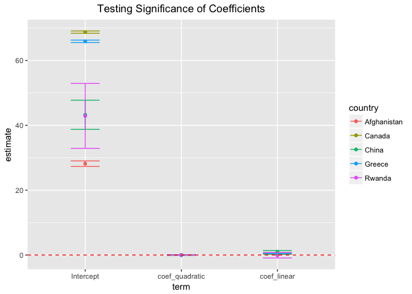

hw06
================
Qiaoyue Tang
2017/11/4

Part 1: Character Data
======================

### String Basics

*1. In code that doesn’t use stringr, you’ll often see paste() and paste0(). What’s the difference between the two functions? What stringr function are they equivalent to? How do the functions differ in their handling of NA?*

-   The difference between paste() and paste0() is that the default for sep argument is " " in paste and "" in paste0. So if we try to connect "he" and "llo" using default setting in paste, it will give "he llo", while paste0 will give "hello". paste0 will be more efficient if we want no space in between when connecting the strings. `str_c` is the function in stringr that connects strings. It also has "" as default setting.

``` r
paste("he", "llo")
```

    ## [1] "he llo"

``` r
paste0("he","llo")
```

    ## [1] "hello"

``` r
str_c("he","llo")
```

    ## [1] "hello"

-   They handle NAs differently. `str_c` will return only NA if NA appears in one of the strings, but paste and paste0 will convert NA to "NA" and connect it with the other strings.

``` r
str_c("hello",NA)
```

    ## [1] NA

``` r
paste("hello",NA)
```

    ## [1] "hello NA"

``` r
paste0("hello",NA)
```

    ## [1] "helloNA"

*2. In your own words, describe the difference between the sep and collapse arguments to `str_c()`*

-   The sep argument will add strings between arguments, the collapse argument will make the strings to one single string and insert its value in between. Together they can manipulate strings to have different forms. For example,

``` r
a <- c("a","b","c")
b <- c("one","two","three")
str_c(a,b,sep = ", ")
```

    ## [1] "a, one"   "b, two"   "c, three"

``` r
str_c(a,b,collapse = " and ")
```

    ## [1] "aone and btwo and cthree"

``` r
str_c(a,b,sep = ", ", collapse = " and ")
```

    ## [1] "a, one and b, two and c, three"

*3. Use str\_length() and str\_sub() to extract the middle character from a string. What will you do if the string has an even number of characters?*

-   To extract the middle character from a string with odd length, we can do the following:

``` r
my_str <- "hello"
l <- str_length(my_str)
str_sub(my_str, l/2+1, l/2+1)
```

    ## [1] "l"

-   If the character has even length, we can keep the two center characters like below:

``` r
my_str <- "helloworld"
l <- str_length(my_str)
str_sub(my_str, l/2, l/2+1)
```

    ## [1] "ow"

-   In general, we can also use the floor and celling function:

``` r
my_strs <- c("hello", "helloworld")
str_sub(my_strs, floor((str_length(my_strs)+1)/2), ceiling((str_length(my_strs)+1)/2))
```

    ## [1] "l"  "ow"

*4. What does str\_wrap() do? When might you want to use it?*

-   `str_wrap` is used to formatting strings to certain width/indent etc. It would be useful when formatting long strings or paragraphs.
-   For example, it would be useful to change the very long labels to fit beter on a graph.

``` r
my_str <- "This is a wrapper around stri_wrap which implements the Knuth-Plass paragraph wrapping algorithm."
str_wrap(my_str, width = 20)
```

    ## [1] "This is a wrapper\naround stri_wrap\nwhich implements\nthe Knuth-Plass\nparagraph wrapping\nalgorithm."

*5. What does str\_trim() do? What’s the opposite of str\_trim()?*

-   str\_trim removes the whitespace around a string. We can specify if we only want the left/right whitespace to be removed or both.

``` r
my_str <- "   String with whitespaces in between   "
str_trim(my_str, "right")
```

    ## [1] "   String with whitespaces in between"

-   The opposite of `str_trim` is `str_pad` which adds white spaces to either left/right end or both. A little different from `str_trim`, we can speficy the width of whitespaces.

``` r
my_str <- "abc"
str_pad(my_str, 5, "both")
```

    ## [1] " abc "

*6. Write a function that turns (e.g.) a vector c("a", "b", "c") into the string a, b, and c. Think carefully about what it should do if given a vector of length 0, 1, or 2.*

-   The idea is to collapse the string into a single string with "," in between and then add "and" between the second-last and the last strings.
-   To do this, we want to first delete the last string of x, collapse the rest, and then use str\_c to connect the trimmed string in first part the and the trimmed last string with ", and ".
-   For strings with length &lt; 2, we want to just return the original string.

``` r
connect_str <- function(x, sep = ", ", y = ", and ") {
  if(length(x) > 1) {
    first <- str_c(x[-length(x)], collapse = sep)
    str_c(first, x[length(x)], sep = y)
  } else {
      x
    }
}
connect_str(c("a", "b", "c"))
```

    ## [1] "a, b, and c"

``` r
connect_str("")
```

    ## [1] ""

``` r
connect_str("a")
```

    ## [1] "a"

### Basic Matches

*7. Explain why each of these strings don’t match a : "", "\\", "\\".*

-   `\`: this is used to escape character in regular expression.
-   `\\`: this is a string that represent the regular expression so it does not work
-   `\\\`: we need another one to escape the string expression so this does not work either.
-   We need `\\\\` to match a

*8. How would you match the sequence "'?*

``` r
a <- c("abc","\"'\\","def")
str_view(a, "\\\"'\\\\")
```

<!--html_preserve-->

<script type="application/json" data-for="htmlwidget-30859e523132f994c35b">{"x":{"html":"<ul>\n  <li>abc\u003c/li>\n  <li><span class='match'>\"'\\\u003c/span>\u003c/li>\n  <li>def\u003c/li>\n\u003c/ul>"},"evals":[],"jsHooks":[]}</script>
<!--/html_preserve-->
*9. What patterns will the regular expression ...... match? How would you represent it as a string?*

-   This will match the patterns that have a dot followed by any single character repeated three times. The second dot in .. is the regular expression for any character, and . is to escape the special expression of the dot that we actually want to match.

``` r
b <- c("abc.abc","stat.u.b.c","abc")
str_view(b, "\\..\\..\\..")
```

<!--html_preserve-->

<script type="application/json" data-for="htmlwidget-e38e645fc08abd7608f4">{"x":{"html":"<ul>\n  <li>abc.abc\u003c/li>\n  <li>stat<span class='match'>.u.b.c\u003c/span>\u003c/li>\n  <li>abc\u003c/li>\n\u003c/ul>"},"evals":[],"jsHooks":[]}</script>
<!--/html_preserve-->
### Anchors

*10. How would you match the literal string "$^$"?*

-   We need to use escapes to first represent `$^$` with `\\$\\^\\$` and then use `^` and `$` in the front and end to ensure we only find strings that only ontains `$^$`.

``` r
c <- c("$^$", "a$^$b")
str_view(c, "^\\$\\^\\$$")
```

<!--html_preserve-->

<script type="application/json" data-for="htmlwidget-793c38f95125def1671c">{"x":{"html":"<ul>\n  <li><span class='match'>$^$\u003c/span>\u003c/li>\n  <li>a$^$b\u003c/li>\n\u003c/ul>"},"evals":[],"jsHooks":[]}</script>
<!--/html_preserve-->
*11. Given the corpus of common words in `stringr::words`, create regular expressions that find all words that: (1) Start with "y" (2) End with "x" (3) Are exactly three letters long. (Don’t cheat by using str\_length()!) (4) Have seven letters or more. Since this list is long, you might want to use the match argument to str\_view() to show only the matching or non-matching words.*

``` r
str_view(words, "^y", match = T)
```

<!--html_preserve-->

<script type="application/json" data-for="htmlwidget-a9600b180c1597bdaa80">{"x":{"html":"<ul>\n  <li><span class='match'>y\u003c/span>ear\u003c/li>\n  <li><span class='match'>y\u003c/span>es\u003c/li>\n  <li><span class='match'>y\u003c/span>esterday\u003c/li>\n  <li><span class='match'>y\u003c/span>et\u003c/li>\n  <li><span class='match'>y\u003c/span>ou\u003c/li>\n  <li><span class='match'>y\u003c/span>oung\u003c/li>\n\u003c/ul>"},"evals":[],"jsHooks":[]}</script>
<!--/html_preserve-->
``` r
str_view(words, "x$", match = T)
```

<!--html_preserve-->

<script type="application/json" data-for="htmlwidget-0474b302036434ee2825">{"x":{"html":"<ul>\n  <li>bo<span class='match'>x\u003c/span>\u003c/li>\n  <li>se<span class='match'>x\u003c/span>\u003c/li>\n  <li>si<span class='match'>x\u003c/span>\u003c/li>\n  <li>ta<span class='match'>x\u003c/span>\u003c/li>\n\u003c/ul>"},"evals":[],"jsHooks":[]}</script>
<!--/html_preserve-->
``` r
str_view(words, "^...$", match = T)
```

<!--html_preserve-->

<script type="application/json" data-for="htmlwidget-60d243582613887bed19">{"x":{"html":"<ul>\n  <li><span class='match'>act\u003c/span>\u003c/li>\n  <li><span class='match'>add\u003c/span>\u003c/li>\n  <li><span class='match'>age\u003c/span>\u003c/li>\n  <li><span class='match'>ago\u003c/span>\u003c/li>\n  <li><span class='match'>air\u003c/span>\u003c/li>\n  <li><span class='match'>all\u003c/span>\u003c/li>\n  <li><span class='match'>and\u003c/span>\u003c/li>\n  <li><span class='match'>any\u003c/span>\u003c/li>\n  <li><span class='match'>arm\u003c/span>\u003c/li>\n  <li><span class='match'>art\u003c/span>\u003c/li>\n  <li><span class='match'>ask\u003c/span>\u003c/li>\n  <li><span class='match'>bad\u003c/span>\u003c/li>\n  <li><span class='match'>bag\u003c/span>\u003c/li>\n  <li><span class='match'>bar\u003c/span>\u003c/li>\n  <li><span class='match'>bed\u003c/span>\u003c/li>\n  <li><span class='match'>bet\u003c/span>\u003c/li>\n  <li><span class='match'>big\u003c/span>\u003c/li>\n  <li><span class='match'>bit\u003c/span>\u003c/li>\n  <li><span class='match'>box\u003c/span>\u003c/li>\n  <li><span class='match'>boy\u003c/span>\u003c/li>\n  <li><span class='match'>bus\u003c/span>\u003c/li>\n  <li><span class='match'>but\u003c/span>\u003c/li>\n  <li><span class='match'>buy\u003c/span>\u003c/li>\n  <li><span class='match'>can\u003c/span>\u003c/li>\n  <li><span class='match'>car\u003c/span>\u003c/li>\n  <li><span class='match'>cat\u003c/span>\u003c/li>\n  <li><span class='match'>cup\u003c/span>\u003c/li>\n  <li><span class='match'>cut\u003c/span>\u003c/li>\n  <li><span class='match'>dad\u003c/span>\u003c/li>\n  <li><span class='match'>day\u003c/span>\u003c/li>\n  <li><span class='match'>die\u003c/span>\u003c/li>\n  <li><span class='match'>dog\u003c/span>\u003c/li>\n  <li><span class='match'>dry\u003c/span>\u003c/li>\n  <li><span class='match'>due\u003c/span>\u003c/li>\n  <li><span class='match'>eat\u003c/span>\u003c/li>\n  <li><span class='match'>egg\u003c/span>\u003c/li>\n  <li><span class='match'>end\u003c/span>\u003c/li>\n  <li><span class='match'>eye\u003c/span>\u003c/li>\n  <li><span class='match'>far\u003c/span>\u003c/li>\n  <li><span class='match'>few\u003c/span>\u003c/li>\n  <li><span class='match'>fit\u003c/span>\u003c/li>\n  <li><span class='match'>fly\u003c/span>\u003c/li>\n  <li><span class='match'>for\u003c/span>\u003c/li>\n  <li><span class='match'>fun\u003c/span>\u003c/li>\n  <li><span class='match'>gas\u003c/span>\u003c/li>\n  <li><span class='match'>get\u003c/span>\u003c/li>\n  <li><span class='match'>god\u003c/span>\u003c/li>\n  <li><span class='match'>guy\u003c/span>\u003c/li>\n  <li><span class='match'>hit\u003c/span>\u003c/li>\n  <li><span class='match'>hot\u003c/span>\u003c/li>\n  <li><span class='match'>how\u003c/span>\u003c/li>\n  <li><span class='match'>job\u003c/span>\u003c/li>\n  <li><span class='match'>key\u003c/span>\u003c/li>\n  <li><span class='match'>kid\u003c/span>\u003c/li>\n  <li><span class='match'>lad\u003c/span>\u003c/li>\n  <li><span class='match'>law\u003c/span>\u003c/li>\n  <li><span class='match'>lay\u003c/span>\u003c/li>\n  <li><span class='match'>leg\u003c/span>\u003c/li>\n  <li><span class='match'>let\u003c/span>\u003c/li>\n  <li><span class='match'>lie\u003c/span>\u003c/li>\n  <li><span class='match'>lot\u003c/span>\u003c/li>\n  <li><span class='match'>low\u003c/span>\u003c/li>\n  <li><span class='match'>man\u003c/span>\u003c/li>\n  <li><span class='match'>may\u003c/span>\u003c/li>\n  <li><span class='match'>mrs\u003c/span>\u003c/li>\n  <li><span class='match'>new\u003c/span>\u003c/li>\n  <li><span class='match'>non\u003c/span>\u003c/li>\n  <li><span class='match'>not\u003c/span>\u003c/li>\n  <li><span class='match'>now\u003c/span>\u003c/li>\n  <li><span class='match'>odd\u003c/span>\u003c/li>\n  <li><span class='match'>off\u003c/span>\u003c/li>\n  <li><span class='match'>old\u003c/span>\u003c/li>\n  <li><span class='match'>one\u003c/span>\u003c/li>\n  <li><span class='match'>out\u003c/span>\u003c/li>\n  <li><span class='match'>own\u003c/span>\u003c/li>\n  <li><span class='match'>pay\u003c/span>\u003c/li>\n  <li><span class='match'>per\u003c/span>\u003c/li>\n  <li><span class='match'>put\u003c/span>\u003c/li>\n  <li><span class='match'>red\u003c/span>\u003c/li>\n  <li><span class='match'>rid\u003c/span>\u003c/li>\n  <li><span class='match'>run\u003c/span>\u003c/li>\n  <li><span class='match'>say\u003c/span>\u003c/li>\n  <li><span class='match'>see\u003c/span>\u003c/li>\n  <li><span class='match'>set\u003c/span>\u003c/li>\n  <li><span class='match'>sex\u003c/span>\u003c/li>\n  <li><span class='match'>she\u003c/span>\u003c/li>\n  <li><span class='match'>sir\u003c/span>\u003c/li>\n  <li><span class='match'>sit\u003c/span>\u003c/li>\n  <li><span class='match'>six\u003c/span>\u003c/li>\n  <li><span class='match'>son\u003c/span>\u003c/li>\n  <li><span class='match'>sun\u003c/span>\u003c/li>\n  <li><span class='match'>tax\u003c/span>\u003c/li>\n  <li><span class='match'>tea\u003c/span>\u003c/li>\n  <li><span class='match'>ten\u003c/span>\u003c/li>\n  <li><span class='match'>the\u003c/span>\u003c/li>\n  <li><span class='match'>tie\u003c/span>\u003c/li>\n  <li><span class='match'>too\u003c/span>\u003c/li>\n  <li><span class='match'>top\u003c/span>\u003c/li>\n  <li><span class='match'>try\u003c/span>\u003c/li>\n  <li><span class='match'>two\u003c/span>\u003c/li>\n  <li><span class='match'>use\u003c/span>\u003c/li>\n  <li><span class='match'>war\u003c/span>\u003c/li>\n  <li><span class='match'>way\u003c/span>\u003c/li>\n  <li><span class='match'>wee\u003c/span>\u003c/li>\n  <li><span class='match'>who\u003c/span>\u003c/li>\n  <li><span class='match'>why\u003c/span>\u003c/li>\n  <li><span class='match'>win\u003c/span>\u003c/li>\n  <li><span class='match'>yes\u003c/span>\u003c/li>\n  <li><span class='match'>yet\u003c/span>\u003c/li>\n  <li><span class='match'>you\u003c/span>\u003c/li>\n\u003c/ul>"},"evals":[],"jsHooks":[]}</script>
<!--/html_preserve-->
``` r
str_view(words, ".......", match = T)
```

<!--html_preserve-->

<script type="application/json" data-for="htmlwidget-9ab14cc3b9d307f0898e">{"x":{"html":"<ul>\n  <li><span class='match'>absolut\u003c/span>e\u003c/li>\n  <li><span class='match'>account\u003c/span>\u003c/li>\n  <li><span class='match'>achieve\u003c/span>\u003c/li>\n  <li><span class='match'>address\u003c/span>\u003c/li>\n  <li><span class='match'>adverti\u003c/span>se\u003c/li>\n  <li><span class='match'>afterno\u003c/span>on\u003c/li>\n  <li><span class='match'>against\u003c/span>\u003c/li>\n  <li><span class='match'>already\u003c/span>\u003c/li>\n  <li><span class='match'>alright\u003c/span>\u003c/li>\n  <li><span class='match'>althoug\u003c/span>h\u003c/li>\n  <li><span class='match'>america\u003c/span>\u003c/li>\n  <li><span class='match'>another\u003c/span>\u003c/li>\n  <li><span class='match'>apparen\u003c/span>t\u003c/li>\n  <li><span class='match'>appoint\u003c/span>\u003c/li>\n  <li><span class='match'>approac\u003c/span>h\u003c/li>\n  <li><span class='match'>appropr\u003c/span>iate\u003c/li>\n  <li><span class='match'>arrange\u003c/span>\u003c/li>\n  <li><span class='match'>associa\u003c/span>te\u003c/li>\n  <li><span class='match'>authori\u003c/span>ty\u003c/li>\n  <li><span class='match'>availab\u003c/span>le\u003c/li>\n  <li><span class='match'>balance\u003c/span>\u003c/li>\n  <li><span class='match'>because\u003c/span>\u003c/li>\n  <li><span class='match'>believe\u003c/span>\u003c/li>\n  <li><span class='match'>benefit\u003c/span>\u003c/li>\n  <li><span class='match'>between\u003c/span>\u003c/li>\n  <li><span class='match'>brillia\u003c/span>nt\u003c/li>\n  <li><span class='match'>britain\u003c/span>\u003c/li>\n  <li><span class='match'>brother\u003c/span>\u003c/li>\n  <li><span class='match'>busines\u003c/span>s\u003c/li>\n  <li><span class='match'>certain\u003c/span>\u003c/li>\n  <li><span class='match'>chairma\u003c/span>n\u003c/li>\n  <li><span class='match'>charact\u003c/span>er\u003c/li>\n  <li><span class='match'>Christm\u003c/span>as\u003c/li>\n  <li><span class='match'>colleag\u003c/span>ue\u003c/li>\n  <li><span class='match'>collect\u003c/span>\u003c/li>\n  <li><span class='match'>college\u003c/span>\u003c/li>\n  <li><span class='match'>comment\u003c/span>\u003c/li>\n  <li><span class='match'>committ\u003c/span>ee\u003c/li>\n  <li><span class='match'>communi\u003c/span>ty\u003c/li>\n  <li><span class='match'>company\u003c/span>\u003c/li>\n  <li><span class='match'>compare\u003c/span>\u003c/li>\n  <li><span class='match'>complet\u003c/span>e\u003c/li>\n  <li><span class='match'>compute\u003c/span>\u003c/li>\n  <li><span class='match'>concern\u003c/span>\u003c/li>\n  <li><span class='match'>conditi\u003c/span>on\u003c/li>\n  <li><span class='match'>conside\u003c/span>r\u003c/li>\n  <li><span class='match'>consult\u003c/span>\u003c/li>\n  <li><span class='match'>contact\u003c/span>\u003c/li>\n  <li><span class='match'>continu\u003c/span>e\u003c/li>\n  <li><span class='match'>contrac\u003c/span>t\u003c/li>\n  <li><span class='match'>control\u003c/span>\u003c/li>\n  <li><span class='match'>convers\u003c/span>e\u003c/li>\n  <li><span class='match'>correct\u003c/span>\u003c/li>\n  <li><span class='match'>council\u003c/span>\u003c/li>\n  <li><span class='match'>country\u003c/span>\u003c/li>\n  <li><span class='match'>current\u003c/span>\u003c/li>\n  <li><span class='match'>decisio\u003c/span>n\u003c/li>\n  <li><span class='match'>definit\u003c/span>e\u003c/li>\n  <li><span class='match'>departm\u003c/span>ent\u003c/li>\n  <li><span class='match'>describ\u003c/span>e\u003c/li>\n  <li><span class='match'>develop\u003c/span>\u003c/li>\n  <li><span class='match'>differe\u003c/span>nce\u003c/li>\n  <li><span class='match'>difficu\u003c/span>lt\u003c/li>\n  <li><span class='match'>discuss\u003c/span>\u003c/li>\n  <li><span class='match'>distric\u003c/span>t\u003c/li>\n  <li><span class='match'>documen\u003c/span>t\u003c/li>\n  <li><span class='match'>economy\u003c/span>\u003c/li>\n  <li><span class='match'>educate\u003c/span>\u003c/li>\n  <li><span class='match'>electri\u003c/span>c\u003c/li>\n  <li><span class='match'>encoura\u003c/span>ge\u003c/li>\n  <li><span class='match'>english\u003c/span>\u003c/li>\n  <li><span class='match'>environ\u003c/span>ment\u003c/li>\n  <li><span class='match'>especia\u003c/span>l\u003c/li>\n  <li><span class='match'>evening\u003c/span>\u003c/li>\n  <li><span class='match'>evidenc\u003c/span>e\u003c/li>\n  <li><span class='match'>example\u003c/span>\u003c/li>\n  <li><span class='match'>exercis\u003c/span>e\u003c/li>\n  <li><span class='match'>expense\u003c/span>\u003c/li>\n  <li><span class='match'>experie\u003c/span>nce\u003c/li>\n  <li><span class='match'>explain\u003c/span>\u003c/li>\n  <li><span class='match'>express\u003c/span>\u003c/li>\n  <li><span class='match'>finance\u003c/span>\u003c/li>\n  <li><span class='match'>fortune\u003c/span>\u003c/li>\n  <li><span class='match'>forward\u003c/span>\u003c/li>\n  <li><span class='match'>functio\u003c/span>n\u003c/li>\n  <li><span class='match'>further\u003c/span>\u003c/li>\n  <li><span class='match'>general\u003c/span>\u003c/li>\n  <li><span class='match'>germany\u003c/span>\u003c/li>\n  <li><span class='match'>goodbye\u003c/span>\u003c/li>\n  <li><span class='match'>history\u003c/span>\u003c/li>\n  <li><span class='match'>holiday\u003c/span>\u003c/li>\n  <li><span class='match'>hospita\u003c/span>l\u003c/li>\n  <li><span class='match'>however\u003c/span>\u003c/li>\n  <li><span class='match'>hundred\u003c/span>\u003c/li>\n  <li><span class='match'>husband\u003c/span>\u003c/li>\n  <li><span class='match'>identif\u003c/span>y\u003c/li>\n  <li><span class='match'>imagine\u003c/span>\u003c/li>\n  <li><span class='match'>importa\u003c/span>nt\u003c/li>\n  <li><span class='match'>improve\u003c/span>\u003c/li>\n  <li><span class='match'>include\u003c/span>\u003c/li>\n  <li><span class='match'>increas\u003c/span>e\u003c/li>\n  <li><span class='match'>individ\u003c/span>ual\u003c/li>\n  <li><span class='match'>industr\u003c/span>y\u003c/li>\n  <li><span class='match'>instead\u003c/span>\u003c/li>\n  <li><span class='match'>interes\u003c/span>t\u003c/li>\n  <li><span class='match'>introdu\u003c/span>ce\u003c/li>\n  <li><span class='match'>involve\u003c/span>\u003c/li>\n  <li><span class='match'>kitchen\u003c/span>\u003c/li>\n  <li><span class='match'>languag\u003c/span>e\u003c/li>\n  <li><span class='match'>machine\u003c/span>\u003c/li>\n  <li><span class='match'>meaning\u003c/span>\u003c/li>\n  <li><span class='match'>measure\u003c/span>\u003c/li>\n  <li><span class='match'>mention\u003c/span>\u003c/li>\n  <li><span class='match'>million\u003c/span>\u003c/li>\n  <li><span class='match'>ministe\u003c/span>r\u003c/li>\n  <li><span class='match'>morning\u003c/span>\u003c/li>\n  <li><span class='match'>necessa\u003c/span>ry\u003c/li>\n  <li><span class='match'>obvious\u003c/span>\u003c/li>\n  <li><span class='match'>occasio\u003c/span>n\u003c/li>\n  <li><span class='match'>operate\u003c/span>\u003c/li>\n  <li><span class='match'>opportu\u003c/span>nity\u003c/li>\n  <li><span class='match'>organiz\u003c/span>e\u003c/li>\n  <li><span class='match'>origina\u003c/span>l\u003c/li>\n  <li><span class='match'>otherwi\u003c/span>se\u003c/li>\n  <li><span class='match'>paragra\u003c/span>ph\u003c/li>\n  <li><span class='match'>particu\u003c/span>lar\u003c/li>\n  <li><span class='match'>pension\u003c/span>\u003c/li>\n  <li><span class='match'>percent\u003c/span>\u003c/li>\n  <li><span class='match'>perfect\u003c/span>\u003c/li>\n  <li><span class='match'>perhaps\u003c/span>\u003c/li>\n  <li><span class='match'>photogr\u003c/span>aph\u003c/li>\n  <li><span class='match'>picture\u003c/span>\u003c/li>\n  <li><span class='match'>politic\u003c/span>\u003c/li>\n  <li><span class='match'>positio\u003c/span>n\u003c/li>\n  <li><span class='match'>positiv\u003c/span>e\u003c/li>\n  <li><span class='match'>possibl\u003c/span>e\u003c/li>\n  <li><span class='match'>practis\u003c/span>e\u003c/li>\n  <li><span class='match'>prepare\u003c/span>\u003c/li>\n  <li><span class='match'>present\u003c/span>\u003c/li>\n  <li><span class='match'>pressur\u003c/span>e\u003c/li>\n  <li><span class='match'>presume\u003c/span>\u003c/li>\n  <li><span class='match'>previou\u003c/span>s\u003c/li>\n  <li><span class='match'>private\u003c/span>\u003c/li>\n  <li><span class='match'>probabl\u003c/span>e\u003c/li>\n  <li><span class='match'>problem\u003c/span>\u003c/li>\n  <li><span class='match'>proceed\u003c/span>\u003c/li>\n  <li><span class='match'>process\u003c/span>\u003c/li>\n  <li><span class='match'>produce\u003c/span>\u003c/li>\n  <li><span class='match'>product\u003c/span>\u003c/li>\n  <li><span class='match'>program\u003c/span>me\u003c/li>\n  <li><span class='match'>project\u003c/span>\u003c/li>\n  <li><span class='match'>propose\u003c/span>\u003c/li>\n  <li><span class='match'>protect\u003c/span>\u003c/li>\n  <li><span class='match'>provide\u003c/span>\u003c/li>\n  <li><span class='match'>purpose\u003c/span>\u003c/li>\n  <li><span class='match'>quality\u003c/span>\u003c/li>\n  <li><span class='match'>quarter\u003c/span>\u003c/li>\n  <li><span class='match'>questio\u003c/span>n\u003c/li>\n  <li><span class='match'>realise\u003c/span>\u003c/li>\n  <li><span class='match'>receive\u003c/span>\u003c/li>\n  <li><span class='match'>recogni\u003c/span>ze\u003c/li>\n  <li><span class='match'>recomme\u003c/span>nd\u003c/li>\n  <li><span class='match'>relatio\u003c/span>n\u003c/li>\n  <li><span class='match'>remembe\u003c/span>r\u003c/li>\n  <li><span class='match'>represe\u003c/span>nt\u003c/li>\n  <li><span class='match'>require\u003c/span>\u003c/li>\n  <li><span class='match'>researc\u003c/span>h\u003c/li>\n  <li><span class='match'>resourc\u003c/span>e\u003c/li>\n  <li><span class='match'>respect\u003c/span>\u003c/li>\n  <li><span class='match'>respons\u003c/span>ible\u003c/li>\n  <li><span class='match'>saturda\u003c/span>y\u003c/li>\n  <li><span class='match'>science\u003c/span>\u003c/li>\n  <li><span class='match'>scotlan\u003c/span>d\u003c/li>\n  <li><span class='match'>secreta\u003c/span>ry\u003c/li>\n  <li><span class='match'>section\u003c/span>\u003c/li>\n  <li><span class='match'>separat\u003c/span>e\u003c/li>\n  <li><span class='match'>serious\u003c/span>\u003c/li>\n  <li><span class='match'>service\u003c/span>\u003c/li>\n  <li><span class='match'>similar\u003c/span>\u003c/li>\n  <li><span class='match'>situate\u003c/span>\u003c/li>\n  <li><span class='match'>society\u003c/span>\u003c/li>\n  <li><span class='match'>special\u003c/span>\u003c/li>\n  <li><span class='match'>specifi\u003c/span>c\u003c/li>\n  <li><span class='match'>standar\u003c/span>d\u003c/li>\n  <li><span class='match'>station\u003c/span>\u003c/li>\n  <li><span class='match'>straigh\u003c/span>t\u003c/li>\n  <li><span class='match'>strateg\u003c/span>y\u003c/li>\n  <li><span class='match'>structu\u003c/span>re\u003c/li>\n  <li><span class='match'>student\u003c/span>\u003c/li>\n  <li><span class='match'>subject\u003c/span>\u003c/li>\n  <li><span class='match'>succeed\u003c/span>\u003c/li>\n  <li><span class='match'>suggest\u003c/span>\u003c/li>\n  <li><span class='match'>support\u003c/span>\u003c/li>\n  <li><span class='match'>suppose\u003c/span>\u003c/li>\n  <li><span class='match'>surpris\u003c/span>e\u003c/li>\n  <li><span class='match'>telepho\u003c/span>ne\u003c/li>\n  <li><span class='match'>televis\u003c/span>ion\u003c/li>\n  <li><span class='match'>terribl\u003c/span>e\u003c/li>\n  <li><span class='match'>therefo\u003c/span>re\u003c/li>\n  <li><span class='match'>thirtee\u003c/span>n\u003c/li>\n  <li><span class='match'>thousan\u003c/span>d\u003c/li>\n  <li><span class='match'>through\u003c/span>\u003c/li>\n  <li><span class='match'>thursda\u003c/span>y\u003c/li>\n  <li><span class='match'>togethe\u003c/span>r\u003c/li>\n  <li><span class='match'>tomorro\u003c/span>w\u003c/li>\n  <li><span class='match'>tonight\u003c/span>\u003c/li>\n  <li><span class='match'>traffic\u003c/span>\u003c/li>\n  <li><span class='match'>transpo\u003c/span>rt\u003c/li>\n  <li><span class='match'>trouble\u003c/span>\u003c/li>\n  <li><span class='match'>tuesday\u003c/span>\u003c/li>\n  <li><span class='match'>underst\u003c/span>and\u003c/li>\n  <li><span class='match'>univers\u003c/span>ity\u003c/li>\n  <li><span class='match'>various\u003c/span>\u003c/li>\n  <li><span class='match'>village\u003c/span>\u003c/li>\n  <li><span class='match'>wednesd\u003c/span>ay\u003c/li>\n  <li><span class='match'>welcome\u003c/span>\u003c/li>\n  <li><span class='match'>whether\u003c/span>\u003c/li>\n  <li><span class='match'>without\u003c/span>\u003c/li>\n  <li><span class='match'>yesterd\u003c/span>ay\u003c/li>\n\u003c/ul>"},"evals":[],"jsHooks":[]}</script>
<!--/html_preserve-->
### Character classes and Alternatives

*12. Create regular expressions to find all words that: (1)Start with a vowel. (2)That only contain consonants. (Hint: thinking about matching “not”-vowels.) (3)End with ed, but not with eed. (4)End with ing or ise.*

``` r
str_view(words, "^[aeiou]", match = T)
```

<!--html_preserve-->

<script type="application/json" data-for="htmlwidget-c7b72520ade7c1598cce">{"x":{"html":"<ul>\n  <li><span class='match'>a\u003c/span>\u003c/li>\n  <li><span class='match'>a\u003c/span>ble\u003c/li>\n  <li><span class='match'>a\u003c/span>bout\u003c/li>\n  <li><span class='match'>a\u003c/span>bsolute\u003c/li>\n  <li><span class='match'>a\u003c/span>ccept\u003c/li>\n  <li><span class='match'>a\u003c/span>ccount\u003c/li>\n  <li><span class='match'>a\u003c/span>chieve\u003c/li>\n  <li><span class='match'>a\u003c/span>cross\u003c/li>\n  <li><span class='match'>a\u003c/span>ct\u003c/li>\n  <li><span class='match'>a\u003c/span>ctive\u003c/li>\n  <li><span class='match'>a\u003c/span>ctual\u003c/li>\n  <li><span class='match'>a\u003c/span>dd\u003c/li>\n  <li><span class='match'>a\u003c/span>ddress\u003c/li>\n  <li><span class='match'>a\u003c/span>dmit\u003c/li>\n  <li><span class='match'>a\u003c/span>dvertise\u003c/li>\n  <li><span class='match'>a\u003c/span>ffect\u003c/li>\n  <li><span class='match'>a\u003c/span>fford\u003c/li>\n  <li><span class='match'>a\u003c/span>fter\u003c/li>\n  <li><span class='match'>a\u003c/span>fternoon\u003c/li>\n  <li><span class='match'>a\u003c/span>gain\u003c/li>\n  <li><span class='match'>a\u003c/span>gainst\u003c/li>\n  <li><span class='match'>a\u003c/span>ge\u003c/li>\n  <li><span class='match'>a\u003c/span>gent\u003c/li>\n  <li><span class='match'>a\u003c/span>go\u003c/li>\n  <li><span class='match'>a\u003c/span>gree\u003c/li>\n  <li><span class='match'>a\u003c/span>ir\u003c/li>\n  <li><span class='match'>a\u003c/span>ll\u003c/li>\n  <li><span class='match'>a\u003c/span>llow\u003c/li>\n  <li><span class='match'>a\u003c/span>lmost\u003c/li>\n  <li><span class='match'>a\u003c/span>long\u003c/li>\n  <li><span class='match'>a\u003c/span>lready\u003c/li>\n  <li><span class='match'>a\u003c/span>lright\u003c/li>\n  <li><span class='match'>a\u003c/span>lso\u003c/li>\n  <li><span class='match'>a\u003c/span>lthough\u003c/li>\n  <li><span class='match'>a\u003c/span>lways\u003c/li>\n  <li><span class='match'>a\u003c/span>merica\u003c/li>\n  <li><span class='match'>a\u003c/span>mount\u003c/li>\n  <li><span class='match'>a\u003c/span>nd\u003c/li>\n  <li><span class='match'>a\u003c/span>nother\u003c/li>\n  <li><span class='match'>a\u003c/span>nswer\u003c/li>\n  <li><span class='match'>a\u003c/span>ny\u003c/li>\n  <li><span class='match'>a\u003c/span>part\u003c/li>\n  <li><span class='match'>a\u003c/span>pparent\u003c/li>\n  <li><span class='match'>a\u003c/span>ppear\u003c/li>\n  <li><span class='match'>a\u003c/span>pply\u003c/li>\n  <li><span class='match'>a\u003c/span>ppoint\u003c/li>\n  <li><span class='match'>a\u003c/span>pproach\u003c/li>\n  <li><span class='match'>a\u003c/span>ppropriate\u003c/li>\n  <li><span class='match'>a\u003c/span>rea\u003c/li>\n  <li><span class='match'>a\u003c/span>rgue\u003c/li>\n  <li><span class='match'>a\u003c/span>rm\u003c/li>\n  <li><span class='match'>a\u003c/span>round\u003c/li>\n  <li><span class='match'>a\u003c/span>rrange\u003c/li>\n  <li><span class='match'>a\u003c/span>rt\u003c/li>\n  <li><span class='match'>a\u003c/span>s\u003c/li>\n  <li><span class='match'>a\u003c/span>sk\u003c/li>\n  <li><span class='match'>a\u003c/span>ssociate\u003c/li>\n  <li><span class='match'>a\u003c/span>ssume\u003c/li>\n  <li><span class='match'>a\u003c/span>t\u003c/li>\n  <li><span class='match'>a\u003c/span>ttend\u003c/li>\n  <li><span class='match'>a\u003c/span>uthority\u003c/li>\n  <li><span class='match'>a\u003c/span>vailable\u003c/li>\n  <li><span class='match'>a\u003c/span>ware\u003c/li>\n  <li><span class='match'>a\u003c/span>way\u003c/li>\n  <li><span class='match'>a\u003c/span>wful\u003c/li>\n  <li><span class='match'>e\u003c/span>ach\u003c/li>\n  <li><span class='match'>e\u003c/span>arly\u003c/li>\n  <li><span class='match'>e\u003c/span>ast\u003c/li>\n  <li><span class='match'>e\u003c/span>asy\u003c/li>\n  <li><span class='match'>e\u003c/span>at\u003c/li>\n  <li><span class='match'>e\u003c/span>conomy\u003c/li>\n  <li><span class='match'>e\u003c/span>ducate\u003c/li>\n  <li><span class='match'>e\u003c/span>ffect\u003c/li>\n  <li><span class='match'>e\u003c/span>gg\u003c/li>\n  <li><span class='match'>e\u003c/span>ight\u003c/li>\n  <li><span class='match'>e\u003c/span>ither\u003c/li>\n  <li><span class='match'>e\u003c/span>lect\u003c/li>\n  <li><span class='match'>e\u003c/span>lectric\u003c/li>\n  <li><span class='match'>e\u003c/span>leven\u003c/li>\n  <li><span class='match'>e\u003c/span>lse\u003c/li>\n  <li><span class='match'>e\u003c/span>mploy\u003c/li>\n  <li><span class='match'>e\u003c/span>ncourage\u003c/li>\n  <li><span class='match'>e\u003c/span>nd\u003c/li>\n  <li><span class='match'>e\u003c/span>ngine\u003c/li>\n  <li><span class='match'>e\u003c/span>nglish\u003c/li>\n  <li><span class='match'>e\u003c/span>njoy\u003c/li>\n  <li><span class='match'>e\u003c/span>nough\u003c/li>\n  <li><span class='match'>e\u003c/span>nter\u003c/li>\n  <li><span class='match'>e\u003c/span>nvironment\u003c/li>\n  <li><span class='match'>e\u003c/span>qual\u003c/li>\n  <li><span class='match'>e\u003c/span>special\u003c/li>\n  <li><span class='match'>e\u003c/span>urope\u003c/li>\n  <li><span class='match'>e\u003c/span>ven\u003c/li>\n  <li><span class='match'>e\u003c/span>vening\u003c/li>\n  <li><span class='match'>e\u003c/span>ver\u003c/li>\n  <li><span class='match'>e\u003c/span>very\u003c/li>\n  <li><span class='match'>e\u003c/span>vidence\u003c/li>\n  <li><span class='match'>e\u003c/span>xact\u003c/li>\n  <li><span class='match'>e\u003c/span>xample\u003c/li>\n  <li><span class='match'>e\u003c/span>xcept\u003c/li>\n  <li><span class='match'>e\u003c/span>xcuse\u003c/li>\n  <li><span class='match'>e\u003c/span>xercise\u003c/li>\n  <li><span class='match'>e\u003c/span>xist\u003c/li>\n  <li><span class='match'>e\u003c/span>xpect\u003c/li>\n  <li><span class='match'>e\u003c/span>xpense\u003c/li>\n  <li><span class='match'>e\u003c/span>xperience\u003c/li>\n  <li><span class='match'>e\u003c/span>xplain\u003c/li>\n  <li><span class='match'>e\u003c/span>xpress\u003c/li>\n  <li><span class='match'>e\u003c/span>xtra\u003c/li>\n  <li><span class='match'>e\u003c/span>ye\u003c/li>\n  <li><span class='match'>i\u003c/span>dea\u003c/li>\n  <li><span class='match'>i\u003c/span>dentify\u003c/li>\n  <li><span class='match'>i\u003c/span>f\u003c/li>\n  <li><span class='match'>i\u003c/span>magine\u003c/li>\n  <li><span class='match'>i\u003c/span>mportant\u003c/li>\n  <li><span class='match'>i\u003c/span>mprove\u003c/li>\n  <li><span class='match'>i\u003c/span>n\u003c/li>\n  <li><span class='match'>i\u003c/span>nclude\u003c/li>\n  <li><span class='match'>i\u003c/span>ncome\u003c/li>\n  <li><span class='match'>i\u003c/span>ncrease\u003c/li>\n  <li><span class='match'>i\u003c/span>ndeed\u003c/li>\n  <li><span class='match'>i\u003c/span>ndividual\u003c/li>\n  <li><span class='match'>i\u003c/span>ndustry\u003c/li>\n  <li><span class='match'>i\u003c/span>nform\u003c/li>\n  <li><span class='match'>i\u003c/span>nside\u003c/li>\n  <li><span class='match'>i\u003c/span>nstead\u003c/li>\n  <li><span class='match'>i\u003c/span>nsure\u003c/li>\n  <li><span class='match'>i\u003c/span>nterest\u003c/li>\n  <li><span class='match'>i\u003c/span>nto\u003c/li>\n  <li><span class='match'>i\u003c/span>ntroduce\u003c/li>\n  <li><span class='match'>i\u003c/span>nvest\u003c/li>\n  <li><span class='match'>i\u003c/span>nvolve\u003c/li>\n  <li><span class='match'>i\u003c/span>ssue\u003c/li>\n  <li><span class='match'>i\u003c/span>t\u003c/li>\n  <li><span class='match'>i\u003c/span>tem\u003c/li>\n  <li><span class='match'>o\u003c/span>bvious\u003c/li>\n  <li><span class='match'>o\u003c/span>ccasion\u003c/li>\n  <li><span class='match'>o\u003c/span>dd\u003c/li>\n  <li><span class='match'>o\u003c/span>f\u003c/li>\n  <li><span class='match'>o\u003c/span>ff\u003c/li>\n  <li><span class='match'>o\u003c/span>ffer\u003c/li>\n  <li><span class='match'>o\u003c/span>ffice\u003c/li>\n  <li><span class='match'>o\u003c/span>ften\u003c/li>\n  <li><span class='match'>o\u003c/span>kay\u003c/li>\n  <li><span class='match'>o\u003c/span>ld\u003c/li>\n  <li><span class='match'>o\u003c/span>n\u003c/li>\n  <li><span class='match'>o\u003c/span>nce\u003c/li>\n  <li><span class='match'>o\u003c/span>ne\u003c/li>\n  <li><span class='match'>o\u003c/span>nly\u003c/li>\n  <li><span class='match'>o\u003c/span>pen\u003c/li>\n  <li><span class='match'>o\u003c/span>perate\u003c/li>\n  <li><span class='match'>o\u003c/span>pportunity\u003c/li>\n  <li><span class='match'>o\u003c/span>ppose\u003c/li>\n  <li><span class='match'>o\u003c/span>r\u003c/li>\n  <li><span class='match'>o\u003c/span>rder\u003c/li>\n  <li><span class='match'>o\u003c/span>rganize\u003c/li>\n  <li><span class='match'>o\u003c/span>riginal\u003c/li>\n  <li><span class='match'>o\u003c/span>ther\u003c/li>\n  <li><span class='match'>o\u003c/span>therwise\u003c/li>\n  <li><span class='match'>o\u003c/span>ught\u003c/li>\n  <li><span class='match'>o\u003c/span>ut\u003c/li>\n  <li><span class='match'>o\u003c/span>ver\u003c/li>\n  <li><span class='match'>o\u003c/span>wn\u003c/li>\n  <li><span class='match'>u\u003c/span>nder\u003c/li>\n  <li><span class='match'>u\u003c/span>nderstand\u003c/li>\n  <li><span class='match'>u\u003c/span>nion\u003c/li>\n  <li><span class='match'>u\u003c/span>nit\u003c/li>\n  <li><span class='match'>u\u003c/span>nite\u003c/li>\n  <li><span class='match'>u\u003c/span>niversity\u003c/li>\n  <li><span class='match'>u\u003c/span>nless\u003c/li>\n  <li><span class='match'>u\u003c/span>ntil\u003c/li>\n  <li><span class='match'>u\u003c/span>p\u003c/li>\n  <li><span class='match'>u\u003c/span>pon\u003c/li>\n  <li><span class='match'>u\u003c/span>se\u003c/li>\n  <li><span class='match'>u\u003c/span>sual\u003c/li>\n\u003c/ul>"},"evals":[],"jsHooks":[]}</script>
<!--/html_preserve-->
``` r
str_view(words, "^[^aeiou]*$", match = T)
```

<!--html_preserve-->

<script type="application/json" data-for="htmlwidget-cf9d5e59f58b8769aa5c">{"x":{"html":"<ul>\n  <li><span class='match'>by\u003c/span>\u003c/li>\n  <li><span class='match'>dry\u003c/span>\u003c/li>\n  <li><span class='match'>fly\u003c/span>\u003c/li>\n  <li><span class='match'>mrs\u003c/span>\u003c/li>\n  <li><span class='match'>try\u003c/span>\u003c/li>\n  <li><span class='match'>why\u003c/span>\u003c/li>\n\u003c/ul>"},"evals":[],"jsHooks":[]}</script>
<!--/html_preserve-->
``` r
str_view(words, "[^e]ed$", match = T)
```

<!--html_preserve-->

<script type="application/json" data-for="htmlwidget-aa04827361ce24b0bd21">{"x":{"html":"<ul>\n  <li><span class='match'>bed\u003c/span>\u003c/li>\n  <li>hund<span class='match'>red\u003c/span>\u003c/li>\n  <li><span class='match'>red\u003c/span>\u003c/li>\n\u003c/ul>"},"evals":[],"jsHooks":[]}</script>
<!--/html_preserve-->
``` r
str_view(words, "i(ng|se)$", match = T)
```

<!--html_preserve-->

<script type="application/json" data-for="htmlwidget-c264603106a84030fee8">{"x":{"html":"<ul>\n  <li>advert<span class='match'>ise\u003c/span>\u003c/li>\n  <li>br<span class='match'>ing\u003c/span>\u003c/li>\n  <li>dur<span class='match'>ing\u003c/span>\u003c/li>\n  <li>even<span class='match'>ing\u003c/span>\u003c/li>\n  <li>exerc<span class='match'>ise\u003c/span>\u003c/li>\n  <li>k<span class='match'>ing\u003c/span>\u003c/li>\n  <li>mean<span class='match'>ing\u003c/span>\u003c/li>\n  <li>morn<span class='match'>ing\u003c/span>\u003c/li>\n  <li>otherw<span class='match'>ise\u003c/span>\u003c/li>\n  <li>pract<span class='match'>ise\u003c/span>\u003c/li>\n  <li>ra<span class='match'>ise\u003c/span>\u003c/li>\n  <li>real<span class='match'>ise\u003c/span>\u003c/li>\n  <li>r<span class='match'>ing\u003c/span>\u003c/li>\n  <li>r<span class='match'>ise\u003c/span>\u003c/li>\n  <li>s<span class='match'>ing\u003c/span>\u003c/li>\n  <li>surpr<span class='match'>ise\u003c/span>\u003c/li>\n  <li>th<span class='match'>ing\u003c/span>\u003c/li>\n\u003c/ul>"},"evals":[],"jsHooks":[]}</script>
<!--/html_preserve-->
*13. Empirically verify the rule “i before e except after c”.*

``` r
str_view(words, "[^c]ie", match = TRUE)
```

<!--html_preserve-->

<script type="application/json" data-for="htmlwidget-0914d9ce6e9694a2252f">{"x":{"html":"<ul>\n  <li>ac<span class='match'>hie\u003c/span>ve\u003c/li>\n  <li>be<span class='match'>lie\u003c/span>ve\u003c/li>\n  <li>b<span class='match'>rie\u003c/span>f\u003c/li>\n  <li>c<span class='match'>lie\u003c/span>nt\u003c/li>\n  <li><span class='match'>die\u003c/span>\u003c/li>\n  <li>expe<span class='match'>rie\u003c/span>nce\u003c/li>\n  <li><span class='match'>fie\u003c/span>ld\u003c/li>\n  <li>f<span class='match'>rie\u003c/span>nd\u003c/li>\n  <li><span class='match'>lie\u003c/span>\u003c/li>\n  <li><span class='match'>pie\u003c/span>ce\u003c/li>\n  <li>q<span class='match'>uie\u003c/span>t\u003c/li>\n  <li><span class='match'>tie\u003c/span>\u003c/li>\n  <li><span class='match'>vie\u003c/span>w\u003c/li>\n\u003c/ul>"},"evals":[],"jsHooks":[]}</script>
<!--/html_preserve-->
*14. Is “q” always followed by a “u”?*

``` r
str_view(words, "q[^u]", match = TRUE)
```

<!--html_preserve-->

<script type="application/json" data-for="htmlwidget-7b422a990ff8c702df3e">{"x":{"html":"<ul>\n  <li>\u003c/li>\n\u003c/ul>"},"evals":[],"jsHooks":[]}</script>
<!--/html_preserve-->
-   Yes, because R cannot find a match for anything that is "q followed not by u".

*15. Write a regular expression that matches a word if it’s probably written in British English, not American English.*

-   British English often use ou instead of o, end with ise instead of ize.

``` r
str_view(words, "ou|ise$", match = T)
```

<!--html_preserve-->

<script type="application/json" data-for="htmlwidget-d8ae7b46b859a9b58023">{"x":{"html":"<ul>\n  <li>ab<span class='match'>ou\u003c/span>t\u003c/li>\n  <li>acc<span class='match'>ou\u003c/span>nt\u003c/li>\n  <li>advert<span class='match'>ise\u003c/span>\u003c/li>\n  <li>alth<span class='match'>ou\u003c/span>gh\u003c/li>\n  <li>am<span class='match'>ou\u003c/span>nt\u003c/li>\n  <li>ar<span class='match'>ou\u003c/span>nd\u003c/li>\n  <li>col<span class='match'>ou\u003c/span>r\u003c/li>\n  <li>c<span class='match'>ou\u003c/span>ld\u003c/li>\n  <li>c<span class='match'>ou\u003c/span>ncil\u003c/li>\n  <li>c<span class='match'>ou\u003c/span>nt\u003c/li>\n  <li>c<span class='match'>ou\u003c/span>ntry\u003c/li>\n  <li>c<span class='match'>ou\u003c/span>nty\u003c/li>\n  <li>c<span class='match'>ou\u003c/span>ple\u003c/li>\n  <li>c<span class='match'>ou\u003c/span>rse\u003c/li>\n  <li>c<span class='match'>ou\u003c/span>rt\u003c/li>\n  <li>d<span class='match'>ou\u003c/span>ble\u003c/li>\n  <li>d<span class='match'>ou\u003c/span>bt\u003c/li>\n  <li>enc<span class='match'>ou\u003c/span>rage\u003c/li>\n  <li>en<span class='match'>ou\u003c/span>gh\u003c/li>\n  <li>exerc<span class='match'>ise\u003c/span>\u003c/li>\n  <li>fav<span class='match'>ou\u003c/span>r\u003c/li>\n  <li>f<span class='match'>ou\u003c/span>r\u003c/li>\n  <li>gr<span class='match'>ou\u003c/span>nd\u003c/li>\n  <li>gr<span class='match'>ou\u003c/span>p\u003c/li>\n  <li>h<span class='match'>ou\u003c/span>r\u003c/li>\n  <li>h<span class='match'>ou\u003c/span>se\u003c/li>\n  <li>lab<span class='match'>ou\u003c/span>r\u003c/li>\n  <li>obvi<span class='match'>ou\u003c/span>s\u003c/li>\n  <li>otherw<span class='match'>ise\u003c/span>\u003c/li>\n  <li><span class='match'>ou\u003c/span>ght\u003c/li>\n  <li><span class='match'>ou\u003c/span>t\u003c/li>\n  <li>p<span class='match'>ou\u003c/span>nd\u003c/li>\n  <li>pract<span class='match'>ise\u003c/span>\u003c/li>\n  <li>previ<span class='match'>ou\u003c/span>s\u003c/li>\n  <li>ra<span class='match'>ise\u003c/span>\u003c/li>\n  <li>real<span class='match'>ise\u003c/span>\u003c/li>\n  <li>res<span class='match'>ou\u003c/span>rce\u003c/li>\n  <li>r<span class='match'>ise\u003c/span>\u003c/li>\n  <li>r<span class='match'>ou\u003c/span>nd\u003c/li>\n  <li>seri<span class='match'>ou\u003c/span>s\u003c/li>\n  <li>sh<span class='match'>ou\u003c/span>ld\u003c/li>\n  <li>s<span class='match'>ou\u003c/span>nd\u003c/li>\n  <li>s<span class='match'>ou\u003c/span>th\u003c/li>\n  <li>surpr<span class='match'>ise\u003c/span>\u003c/li>\n  <li>th<span class='match'>ou\u003c/span>\u003c/li>\n  <li>th<span class='match'>ou\u003c/span>gh\u003c/li>\n  <li>th<span class='match'>ou\u003c/span>sand\u003c/li>\n  <li>thr<span class='match'>ou\u003c/span>gh\u003c/li>\n  <li>t<span class='match'>ou\u003c/span>ch\u003c/li>\n  <li>tr<span class='match'>ou\u003c/span>ble\u003c/li>\n  <li>vari<span class='match'>ou\u003c/span>s\u003c/li>\n  <li>with<span class='match'>ou\u003c/span>t\u003c/li>\n  <li>w<span class='match'>ou\u003c/span>ld\u003c/li>\n  <li>y<span class='match'>ou\u003c/span>\u003c/li>\n  <li>y<span class='match'>ou\u003c/span>ng\u003c/li>\n\u003c/ul>"},"evals":[],"jsHooks":[]}</script>
<!--/html_preserve-->
*16. Create a regular expression that will match telephone numbers as commonly written in your country.*

-   We need to use `\\d` to match any digits.

``` r
d <- c("123-456-7890", "12345-678-90", "1-2-3-4-5-6-7-8-9-0")
str_view(d, "\\d\\d\\d-\\d\\d\\d-\\d\\d\\d\\d")
```

<!--html_preserve-->

<script type="application/json" data-for="htmlwidget-25fefaa27214f51e791b">{"x":{"html":"<ul>\n  <li><span class='match'>123-456-7890\u003c/span>\u003c/li>\n  <li>12345-678-90\u003c/li>\n  <li>1-2-3-4-5-6-7-8-9-0\u003c/li>\n\u003c/ul>"},"evals":[],"jsHooks":[]}</script>
<!--/html_preserve-->
### Repetition

*17. Describe the equivalents of ?, +, \* in {m,n} form.*

-   ? is {,1}: matching at most one
-   -   is {1,}: matching at least one
-   -   in {0,}: matching anything from 0 to infinity

\_18. Describe in words what these regular expressions match: (read carefully to see if I’m using a regular expression or a string that defines a regular expression.) (1) ^.\*$ (2) "\\{.+\\}" (3) -- (4) "\\\\{4}"\_

-   `^.*$` means anything single string with length from 0 to infinity
-   `"\\{.+\\}"` means matching strings with at least one character (this can be any character) surrounded by `{}`
-   `\d{4}-\d{2}-\d{2}` means matching exactly 4 digits-exactly 2 digits-exactly 2 digits
-   `"\\\\{4}"` this is the regular expression for `\\{4}` which means exactly 4 backslashes

*19. Create regular expressions to find all words that: (1) Start with three consonants. (2) Have three or more vowels in a row. (3) Have two or more vowel-consonant pairs in a row.*

``` r
str_view(words, "^[^aeiou]{3}", match = TRUE)
```

<!--html_preserve-->

<script type="application/json" data-for="htmlwidget-92aafeed9a337161eeb3">{"x":{"html":"<ul>\n  <li><span class='match'>Chr\u003c/span>ist\u003c/li>\n  <li><span class='match'>Chr\u003c/span>istmas\u003c/li>\n  <li><span class='match'>dry\u003c/span>\u003c/li>\n  <li><span class='match'>fly\u003c/span>\u003c/li>\n  <li><span class='match'>mrs\u003c/span>\u003c/li>\n  <li><span class='match'>sch\u003c/span>eme\u003c/li>\n  <li><span class='match'>sch\u003c/span>ool\u003c/li>\n  <li><span class='match'>str\u003c/span>aight\u003c/li>\n  <li><span class='match'>str\u003c/span>ategy\u003c/li>\n  <li><span class='match'>str\u003c/span>eet\u003c/li>\n  <li><span class='match'>str\u003c/span>ike\u003c/li>\n  <li><span class='match'>str\u003c/span>ong\u003c/li>\n  <li><span class='match'>str\u003c/span>ucture\u003c/li>\n  <li><span class='match'>sys\u003c/span>tem\u003c/li>\n  <li><span class='match'>thr\u003c/span>ee\u003c/li>\n  <li><span class='match'>thr\u003c/span>ough\u003c/li>\n  <li><span class='match'>thr\u003c/span>ow\u003c/li>\n  <li><span class='match'>try\u003c/span>\u003c/li>\n  <li><span class='match'>typ\u003c/span>e\u003c/li>\n  <li><span class='match'>why\u003c/span>\u003c/li>\n\u003c/ul>"},"evals":[],"jsHooks":[]}</script>
<!--/html_preserve-->
``` r
str_view(words, "[aeiou]{3,}", match = TRUE)
```

<!--html_preserve-->

<script type="application/json" data-for="htmlwidget-85d736423c08f324f287">{"x":{"html":"<ul>\n  <li>b<span class='match'>eau\u003c/span>ty\u003c/li>\n  <li>obv<span class='match'>iou\u003c/span>s\u003c/li>\n  <li>prev<span class='match'>iou\u003c/span>s\u003c/li>\n  <li>q<span class='match'>uie\u003c/span>t\u003c/li>\n  <li>ser<span class='match'>iou\u003c/span>s\u003c/li>\n  <li>var<span class='match'>iou\u003c/span>s\u003c/li>\n\u003c/ul>"},"evals":[],"jsHooks":[]}</script>
<!--/html_preserve-->
``` r
str_view(words, "([aeiou][^aeiou]){2,}", match = TRUE)
```

<!--html_preserve-->

<script type="application/json" data-for="htmlwidget-9ea25aaf10b665866035">{"x":{"html":"<ul>\n  <li>abs<span class='match'>olut\u003c/span>e\u003c/li>\n  <li><span class='match'>agen\u003c/span>t\u003c/li>\n  <li><span class='match'>alon\u003c/span>g\u003c/li>\n  <li><span class='match'>americ\u003c/span>a\u003c/li>\n  <li><span class='match'>anot\u003c/span>her\u003c/li>\n  <li><span class='match'>apar\u003c/span>t\u003c/li>\n  <li>app<span class='match'>aren\u003c/span>t\u003c/li>\n  <li>auth<span class='match'>orit\u003c/span>y\u003c/li>\n  <li>ava<span class='match'>ilab\u003c/span>le\u003c/li>\n  <li><span class='match'>awar\u003c/span>e\u003c/li>\n  <li><span class='match'>away\u003c/span>\u003c/li>\n  <li>b<span class='match'>alan\u003c/span>ce\u003c/li>\n  <li>b<span class='match'>asis\u003c/span>\u003c/li>\n  <li>b<span class='match'>ecom\u003c/span>e\u003c/li>\n  <li>b<span class='match'>efor\u003c/span>e\u003c/li>\n  <li>b<span class='match'>egin\u003c/span>\u003c/li>\n  <li>b<span class='match'>ehin\u003c/span>d\u003c/li>\n  <li>b<span class='match'>enefit\u003c/span>\u003c/li>\n  <li>b<span class='match'>usines\u003c/span>s\u003c/li>\n  <li>ch<span class='match'>arac\u003c/span>ter\u003c/li>\n  <li>cl<span class='match'>oses\u003c/span>\u003c/li>\n  <li>comm<span class='match'>unit\u003c/span>y\u003c/li>\n  <li>cons<span class='match'>ider\u003c/span>\u003c/li>\n  <li>c<span class='match'>over\u003c/span>\u003c/li>\n  <li>d<span class='match'>ebat\u003c/span>e\u003c/li>\n  <li>d<span class='match'>ecid\u003c/span>e\u003c/li>\n  <li>d<span class='match'>ecis\u003c/span>ion\u003c/li>\n  <li>d<span class='match'>efinit\u003c/span>e\u003c/li>\n  <li>d<span class='match'>epar\u003c/span>tment\u003c/li>\n  <li>d<span class='match'>epen\u003c/span>d\u003c/li>\n  <li>d<span class='match'>esig\u003c/span>n\u003c/li>\n  <li>d<span class='match'>evelop\u003c/span>\u003c/li>\n  <li>diff<span class='match'>eren\u003c/span>ce\u003c/li>\n  <li>diff<span class='match'>icul\u003c/span>t\u003c/li>\n  <li>d<span class='match'>irec\u003c/span>t\u003c/li>\n  <li>d<span class='match'>ivid\u003c/span>e\u003c/li>\n  <li>d<span class='match'>ocumen\u003c/span>t\u003c/li>\n  <li>d<span class='match'>urin\u003c/span>g\u003c/li>\n  <li><span class='match'>econom\u003c/span>y\u003c/li>\n  <li><span class='match'>educat\u003c/span>e\u003c/li>\n  <li><span class='match'>elec\u003c/span>t\u003c/li>\n  <li><span class='match'>elec\u003c/span>tric\u003c/li>\n  <li><span class='match'>eleven\u003c/span>\u003c/li>\n  <li>enco<span class='match'>urag\u003c/span>e\u003c/li>\n  <li>env<span class='match'>iron\u003c/span>ment\u003c/li>\n  <li>e<span class='match'>urop\u003c/span>e\u003c/li>\n  <li><span class='match'>even\u003c/span>\u003c/li>\n  <li><span class='match'>evenin\u003c/span>g\u003c/li>\n  <li><span class='match'>ever\u003c/span>\u003c/li>\n  <li><span class='match'>ever\u003c/span>y\u003c/li>\n  <li><span class='match'>eviden\u003c/span>ce\u003c/li>\n  <li><span class='match'>exac\u003c/span>t\u003c/li>\n  <li><span class='match'>exam\u003c/span>ple\u003c/li>\n  <li><span class='match'>exer\u003c/span>cise\u003c/li>\n  <li><span class='match'>exis\u003c/span>t\u003c/li>\n  <li>f<span class='match'>amil\u003c/span>y\u003c/li>\n  <li>f<span class='match'>igur\u003c/span>e\u003c/li>\n  <li>f<span class='match'>inal\u003c/span>\u003c/li>\n  <li>f<span class='match'>inan\u003c/span>ce\u003c/li>\n  <li>f<span class='match'>inis\u003c/span>h\u003c/li>\n  <li>fr<span class='match'>iday\u003c/span>\u003c/li>\n  <li>f<span class='match'>utur\u003c/span>e\u003c/li>\n  <li>g<span class='match'>eneral\u003c/span>\u003c/li>\n  <li>g<span class='match'>over\u003c/span>n\u003c/li>\n  <li>h<span class='match'>oliday\u003c/span>\u003c/li>\n  <li>h<span class='match'>ones\u003c/span>t\u003c/li>\n  <li>hosp<span class='match'>ital\u003c/span>\u003c/li>\n  <li>h<span class='match'>owever\u003c/span>\u003c/li>\n  <li><span class='match'>iden\u003c/span>tify\u003c/li>\n  <li><span class='match'>imagin\u003c/span>e\u003c/li>\n  <li>ind<span class='match'>ivid\u003c/span>ual\u003c/li>\n  <li>int<span class='match'>eres\u003c/span>t\u003c/li>\n  <li>intr<span class='match'>oduc\u003c/span>e\u003c/li>\n  <li><span class='match'>item\u003c/span>\u003c/li>\n  <li>j<span class='match'>esus\u003c/span>\u003c/li>\n  <li>l<span class='match'>evel\u003c/span>\u003c/li>\n  <li>l<span class='match'>ikel\u003c/span>y\u003c/li>\n  <li>l<span class='match'>imit\u003c/span>\u003c/li>\n  <li>l<span class='match'>ocal\u003c/span>\u003c/li>\n  <li>m<span class='match'>ajor\u003c/span>\u003c/li>\n  <li>m<span class='match'>anag\u003c/span>e\u003c/li>\n  <li>me<span class='match'>anin\u003c/span>g\u003c/li>\n  <li>me<span class='match'>asur\u003c/span>e\u003c/li>\n  <li>m<span class='match'>inis\u003c/span>ter\u003c/li>\n  <li>m<span class='match'>inus\u003c/span>\u003c/li>\n  <li>m<span class='match'>inut\u003c/span>e\u003c/li>\n  <li>m<span class='match'>omen\u003c/span>t\u003c/li>\n  <li>m<span class='match'>oney\u003c/span>\u003c/li>\n  <li>m<span class='match'>usic\u003c/span>\u003c/li>\n  <li>n<span class='match'>atur\u003c/span>e\u003c/li>\n  <li>n<span class='match'>eces\u003c/span>sary\u003c/li>\n  <li>n<span class='match'>ever\u003c/span>\u003c/li>\n  <li>n<span class='match'>otic\u003c/span>e\u003c/li>\n  <li><span class='match'>okay\u003c/span>\u003c/li>\n  <li><span class='match'>open\u003c/span>\u003c/li>\n  <li><span class='match'>operat\u003c/span>e\u003c/li>\n  <li>opport<span class='match'>unit\u003c/span>y\u003c/li>\n  <li>org<span class='match'>aniz\u003c/span>e\u003c/li>\n  <li><span class='match'>original\u003c/span>\u003c/li>\n  <li><span class='match'>over\u003c/span>\u003c/li>\n  <li>p<span class='match'>aper\u003c/span>\u003c/li>\n  <li>p<span class='match'>arag\u003c/span>raph\u003c/li>\n  <li>p<span class='match'>aren\u003c/span>t\u003c/li>\n  <li>part<span class='match'>icular\u003c/span>\u003c/li>\n  <li>ph<span class='match'>otog\u003c/span>raph\u003c/li>\n  <li>p<span class='match'>olic\u003c/span>e\u003c/li>\n  <li>p<span class='match'>olic\u003c/span>y\u003c/li>\n  <li>p<span class='match'>olitic\u003c/span>\u003c/li>\n  <li>p<span class='match'>osit\u003c/span>ion\u003c/li>\n  <li>p<span class='match'>ositiv\u003c/span>e\u003c/li>\n  <li>p<span class='match'>ower\u003c/span>\u003c/li>\n  <li>pr<span class='match'>epar\u003c/span>e\u003c/li>\n  <li>pr<span class='match'>esen\u003c/span>t\u003c/li>\n  <li>pr<span class='match'>esum\u003c/span>e\u003c/li>\n  <li>pr<span class='match'>ivat\u003c/span>e\u003c/li>\n  <li>pr<span class='match'>obab\u003c/span>le\u003c/li>\n  <li>pr<span class='match'>oces\u003c/span>s\u003c/li>\n  <li>pr<span class='match'>oduc\u003c/span>e\u003c/li>\n  <li>pr<span class='match'>oduc\u003c/span>t\u003c/li>\n  <li>pr<span class='match'>ojec\u003c/span>t\u003c/li>\n  <li>pr<span class='match'>oper\u003c/span>\u003c/li>\n  <li>pr<span class='match'>opos\u003c/span>e\u003c/li>\n  <li>pr<span class='match'>otec\u003c/span>t\u003c/li>\n  <li>pr<span class='match'>ovid\u003c/span>e\u003c/li>\n  <li>qu<span class='match'>alit\u003c/span>y\u003c/li>\n  <li>re<span class='match'>alis\u003c/span>e\u003c/li>\n  <li>re<span class='match'>ason\u003c/span>\u003c/li>\n  <li>r<span class='match'>ecen\u003c/span>t\u003c/li>\n  <li>r<span class='match'>ecog\u003c/span>nize\u003c/li>\n  <li>r<span class='match'>ecom\u003c/span>mend\u003c/li>\n  <li>r<span class='match'>ecor\u003c/span>d\u003c/li>\n  <li>r<span class='match'>educ\u003c/span>e\u003c/li>\n  <li>r<span class='match'>efer\u003c/span>\u003c/li>\n  <li>r<span class='match'>egar\u003c/span>d\u003c/li>\n  <li>r<span class='match'>elat\u003c/span>ion\u003c/li>\n  <li>r<span class='match'>emem\u003c/span>ber\u003c/li>\n  <li>r<span class='match'>epor\u003c/span>t\u003c/li>\n  <li>repr<span class='match'>esen\u003c/span>t\u003c/li>\n  <li>r<span class='match'>esul\u003c/span>t\u003c/li>\n  <li>r<span class='match'>etur\u003c/span>n\u003c/li>\n  <li>s<span class='match'>atur\u003c/span>day\u003c/li>\n  <li>s<span class='match'>econ\u003c/span>d\u003c/li>\n  <li>secr<span class='match'>etar\u003c/span>y\u003c/li>\n  <li>s<span class='match'>ecur\u003c/span>e\u003c/li>\n  <li>s<span class='match'>eparat\u003c/span>e\u003c/li>\n  <li>s<span class='match'>even\u003c/span>\u003c/li>\n  <li>s<span class='match'>imilar\u003c/span>\u003c/li>\n  <li>sp<span class='match'>ecific\u003c/span>\u003c/li>\n  <li>str<span class='match'>ateg\u003c/span>y\u003c/li>\n  <li>st<span class='match'>uden\u003c/span>t\u003c/li>\n  <li>st<span class='match'>upid\u003c/span>\u003c/li>\n  <li>t<span class='match'>elep\u003c/span>hone\u003c/li>\n  <li>t<span class='match'>elevis\u003c/span>ion\u003c/li>\n  <li>th<span class='match'>erefor\u003c/span>e\u003c/li>\n  <li>tho<span class='match'>usan\u003c/span>d\u003c/li>\n  <li>t<span class='match'>oday\u003c/span>\u003c/li>\n  <li>t<span class='match'>oget\u003c/span>her\u003c/li>\n  <li>t<span class='match'>omor\u003c/span>row\u003c/li>\n  <li>t<span class='match'>onig\u003c/span>ht\u003c/li>\n  <li>t<span class='match'>otal\u003c/span>\u003c/li>\n  <li>t<span class='match'>owar\u003c/span>d\u003c/li>\n  <li>tr<span class='match'>avel\u003c/span>\u003c/li>\n  <li><span class='match'>unit\u003c/span>\u003c/li>\n  <li><span class='match'>unit\u003c/span>e\u003c/li>\n  <li><span class='match'>univer\u003c/span>sity\u003c/li>\n  <li><span class='match'>upon\u003c/span>\u003c/li>\n  <li>v<span class='match'>isit\u003c/span>\u003c/li>\n  <li>w<span class='match'>ater\u003c/span>\u003c/li>\n  <li>w<span class='match'>oman\u003c/span>\u003c/li>\n\u003c/ul>"},"evals":[],"jsHooks":[]}</script>
<!--/html_preserve-->
### Grouping and backreferences

\_20. Describe, in words, what these expressions will match: (1) (.) (2) "(.)(.)\\2\\1" (3) (..) (4) "(.).\\1.\\1" (5) "(.)(.)(.).\*\\3\\2\\1"\_

-   `(.)\1\1` : This will match a single character repeated three times, e.g. "aaa"
-   `"(.)(.)\\2\\1"`: This will match a pair of characters followed by the same pair of characters in reversed order. e.g. "abba".
-   `(..)\1`: This will match any two characters repeated once. e.g. "abab".
-   `"(.).\\1.\\1"`: This will match a character followed by any character, the original character, any other character, the original character again. e.g. "abaca".
-   `"(.)(.)(.).*\\3\\2\\1"`: This will match three characters followed by at least 0 characters (any character) followed by the same three characters but in reverse order. e.g. "abc123cba".

*21. Construct regular expressions to match words that: (1) Start and end with the same character. (2) Contain a repeated pair of letters (e.g. “church” contains “ch” repeated twice.) (3) Contain one letter repeated in at least three places (e.g. “eleven” contains three “e”s.)*

``` r
str_view(words, "^(.).*\\1$", match = T)
```

<!--html_preserve-->

<script type="application/json" data-for="htmlwidget-b506730c8cf018a3f5e1">{"x":{"html":"<ul>\n  <li><span class='match'>america\u003c/span>\u003c/li>\n  <li><span class='match'>area\u003c/span>\u003c/li>\n  <li><span class='match'>dad\u003c/span>\u003c/li>\n  <li><span class='match'>dead\u003c/span>\u003c/li>\n  <li><span class='match'>depend\u003c/span>\u003c/li>\n  <li><span class='match'>educate\u003c/span>\u003c/li>\n  <li><span class='match'>else\u003c/span>\u003c/li>\n  <li><span class='match'>encourage\u003c/span>\u003c/li>\n  <li><span class='match'>engine\u003c/span>\u003c/li>\n  <li><span class='match'>europe\u003c/span>\u003c/li>\n  <li><span class='match'>evidence\u003c/span>\u003c/li>\n  <li><span class='match'>example\u003c/span>\u003c/li>\n  <li><span class='match'>excuse\u003c/span>\u003c/li>\n  <li><span class='match'>exercise\u003c/span>\u003c/li>\n  <li><span class='match'>expense\u003c/span>\u003c/li>\n  <li><span class='match'>experience\u003c/span>\u003c/li>\n  <li><span class='match'>eye\u003c/span>\u003c/li>\n  <li><span class='match'>health\u003c/span>\u003c/li>\n  <li><span class='match'>high\u003c/span>\u003c/li>\n  <li><span class='match'>knock\u003c/span>\u003c/li>\n  <li><span class='match'>level\u003c/span>\u003c/li>\n  <li><span class='match'>local\u003c/span>\u003c/li>\n  <li><span class='match'>nation\u003c/span>\u003c/li>\n  <li><span class='match'>non\u003c/span>\u003c/li>\n  <li><span class='match'>rather\u003c/span>\u003c/li>\n  <li><span class='match'>refer\u003c/span>\u003c/li>\n  <li><span class='match'>remember\u003c/span>\u003c/li>\n  <li><span class='match'>serious\u003c/span>\u003c/li>\n  <li><span class='match'>stairs\u003c/span>\u003c/li>\n  <li><span class='match'>test\u003c/span>\u003c/li>\n  <li><span class='match'>tonight\u003c/span>\u003c/li>\n  <li><span class='match'>transport\u003c/span>\u003c/li>\n  <li><span class='match'>treat\u003c/span>\u003c/li>\n  <li><span class='match'>trust\u003c/span>\u003c/li>\n  <li><span class='match'>window\u003c/span>\u003c/li>\n  <li><span class='match'>yesterday\u003c/span>\u003c/li>\n\u003c/ul>"},"evals":[],"jsHooks":[]}</script>
<!--/html_preserve-->
``` r
str_view(words, "(..).*\\1", match = T)
```

<!--html_preserve-->

<script type="application/json" data-for="htmlwidget-0f3ee266b35be1fb68c6">{"x":{"html":"<ul>\n  <li>ap<span class='match'>propr\u003c/span>iate\u003c/li>\n  <li><span class='match'>church\u003c/span>\u003c/li>\n  <li>c<span class='match'>ondition\u003c/span>\u003c/li>\n  <li><span class='match'>decide\u003c/span>\u003c/li>\n  <li><span class='match'>environmen\u003c/span>t\u003c/li>\n  <li>l<span class='match'>ondon\u003c/span>\u003c/li>\n  <li>pa<span class='match'>ragra\u003c/span>ph\u003c/li>\n  <li>p<span class='match'>articular\u003c/span>\u003c/li>\n  <li><span class='match'>photograph\u003c/span>\u003c/li>\n  <li>p<span class='match'>repare\u003c/span>\u003c/li>\n  <li>p<span class='match'>ressure\u003c/span>\u003c/li>\n  <li>r<span class='match'>emem\u003c/span>ber\u003c/li>\n  <li><span class='match'>repre\u003c/span>sent\u003c/li>\n  <li><span class='match'>require\u003c/span>\u003c/li>\n  <li><span class='match'>sense\u003c/span>\u003c/li>\n  <li>the<span class='match'>refore\u003c/span>\u003c/li>\n  <li>u<span class='match'>nderstand\u003c/span>\u003c/li>\n  <li>w<span class='match'>hethe\u003c/span>r\u003c/li>\n\u003c/ul>"},"evals":[],"jsHooks":[]}</script>
<!--/html_preserve-->
``` r
str_view(words, "(.).*\\1.*\\1", match = T)
```

<!--html_preserve-->

<script type="application/json" data-for="htmlwidget-89a765fa56640e44713e">{"x":{"html":"<ul>\n  <li>a<span class='match'>pprop\u003c/span>riate\u003c/li>\n  <li><span class='match'>availa\u003c/span>ble\u003c/li>\n  <li>b<span class='match'>elieve\u003c/span>\u003c/li>\n  <li>b<span class='match'>etwee\u003c/span>n\u003c/li>\n  <li>bu<span class='match'>siness\u003c/span>\u003c/li>\n  <li>d<span class='match'>egree\u003c/span>\u003c/li>\n  <li>diff<span class='match'>erence\u003c/span>\u003c/li>\n  <li>di<span class='match'>scuss\u003c/span>\u003c/li>\n  <li><span class='match'>eleve\u003c/span>n\u003c/li>\n  <li>e<span class='match'>nvironmen\u003c/span>t\u003c/li>\n  <li><span class='match'>evidence\u003c/span>\u003c/li>\n  <li><span class='match'>exercise\u003c/span>\u003c/li>\n  <li><span class='match'>expense\u003c/span>\u003c/li>\n  <li><span class='match'>experience\u003c/span>\u003c/li>\n  <li><span class='match'>indivi\u003c/span>dual\u003c/li>\n  <li>p<span class='match'>aragra\u003c/span>ph\u003c/li>\n  <li>r<span class='match'>eceive\u003c/span>\u003c/li>\n  <li>r<span class='match'>emembe\u003c/span>r\u003c/li>\n  <li>r<span class='match'>eprese\u003c/span>nt\u003c/li>\n  <li>t<span class='match'>elephone\u003c/span>\u003c/li>\n  <li>th<span class='match'>erefore\u003c/span>\u003c/li>\n  <li>t<span class='match'>omorro\u003c/span>w\u003c/li>\n\u003c/ul>"},"evals":[],"jsHooks":[]}</script>
<!--/html_preserve-->
### Detect matches

*22. What word has the highest number of vowels? What word has the highest proportion of vowels? (Hint: what is the denominator?)*

``` r
vowels <- str_count(words, "[aeiou]")
words[which(vowels == max(vowels))]
```

    ## [1] "appropriate" "associate"   "available"   "colleague"   "encourage"  
    ## [6] "experience"  "individual"  "television"

``` r
prop <- str_count(words, "[aeiou]") / str_length(words)
words[which(prop == max(prop))]
```

    ## [1] "a"

-   We can see the words with the most vowels are listed below (there are ties), the maximum number of vowels in a word is 5.
-   The word "a" has the highest proportion of vowels since it is a vowel itself. Other than "a", "area" and "idea" has the second largest proportions.

### Extract matches

*23. From the Harvard sentences data, extract: (1) The first word from each sentence. (2) All words ending in ing. (3) All plurals.*

-   Introduce `\b` which allows us to search the whole words. It works like `$` but stands for "word boundaries". I learnt this from [here](https://www.regular-expressions.info/wordboundaries.html).

``` r
str_extract(sentences, "[a-z|A-Z]+") %>% head()
```

    ## [1] "The"   "Glue"  "It"    "These" "Rice"  "The"

``` r
ing <- str_subset(sentences, "\\b[A-Z|a-z]+ing\\b")
str_extract(ing, "\\b[A-Z|a-z]+ing\\b") %>%
  head()
```

    ## [1] "spring"  "evening" "morning" "winding" "living"  "king"

``` r
plurals <- str_subset(sentences, "\\b[A-Z|a-z]{3,}s\\b") 
# we want the length to be at least 3 since words like "is" is not a plurals
str_extract(plurals, "\\b[A-Z|a-z]{3,}s\\b") %>%
  head()
```

    ## [1] "planks" "days"   "bowls"  "lemons" "hogs"   "hours"

### Grouped Matches

*24. Find all words that come after a “number” like “one”, “two”, “three” etc. Pull out both the number and the word.*

``` r
pattn <- "(one|two|three|four|five|six|seven|eight|nine|ten) +[^ .]+"
numbs <- str_subset(sentences, pattn)
str_extract(numbs, pattn)
```

    ##  [1] "ten served"    "one over"      "seven books"   "two met"      
    ##  [5] "two factors"   "one and"       "three lists"   "seven is"     
    ##  [9] "two when"      "one floor"     "ten inches"    "one with"     
    ## [13] "one war"       "one button"    "six minutes"   "ten years"    
    ## [17] "one in"        "ten chased"    "one like"      "two shares"   
    ## [21] "two distinct"  "one costs"     "ten two"       "five robins"  
    ## [25] "four kinds"    "one rang"      "ten him"       "three story"  
    ## [29] "ten by"        "one wall"      "three inches"  "ten your"     
    ## [33] "six comes"     "one before"    "three batches" "two leaves"

### Replacing matches

*25. Implement a simple version of str\_to\_lower() using replace\_all().*

``` r
my_str <- "abcDEFgh"
str_replace_all(my_str, c("D" = "d", "E" = "e", "F" = "f"))
```

    ## [1] "abcdefgh"

### Splitting

*26. Split up a string like "apples, pears, and bananas" into individual components.*

``` r
my_str <- "apples, pears, and bananas"
str_split(my_str, ", and |, ")
```

    ## [[1]]
    ## [1] "apples"  "pears"   "bananas"

### Other types of pattern

*27. How would you find all strings containing  with regex() vs. with fixed()?*

-   We need `\\\\` to represent a backslash in regex, but only need to specify `\\` (the regular sting backslash) if we use fixed.

``` r
my_str <- c("abc", "a\\c", "de\\")
str_view(my_str, regex("\\\\"))
```

<!--html_preserve-->

<script type="application/json" data-for="htmlwidget-50a4cc0f5da0e4709138">{"x":{"html":"<ul>\n  <li>abc\u003c/li>\n  <li>a<span class='match'>\\\u003c/span>c\u003c/li>\n  <li>de<span class='match'>\\\u003c/span>\u003c/li>\n\u003c/ul>"},"evals":[],"jsHooks":[]}</script>
<!--/html_preserve-->
``` r
str_view(my_str, fixed("\\"))
```

<!--html_preserve-->

<script type="application/json" data-for="htmlwidget-56b8273cfe5edfc9a871">{"x":{"html":"<ul>\n  <li>abc\u003c/li>\n  <li>a<span class='match'>\\\u003c/span>c\u003c/li>\n  <li>de<span class='match'>\\\u003c/span>\u003c/li>\n\u003c/ul>"},"evals":[],"jsHooks":[]}</script>
<!--/html_preserve-->
### stringi

*28. Find the stringi functions that: (1) Count the number of words. (2) Find duplicated strings. (3) Generate random text.*

-   Count the number of words: stri\_count\_words()
-   Find duplicated strings: stri\_duplicated()
-   Generate random text:
    -   stri\_rand\_lipsum() generates pseudo random text
    -   stri\_rand\_strings() generates random strings
    -   stri\_rand\_shuffle() generates random permutationf of strings

Part 2: Wrting functions
========================

Linear Regression:

``` r
rm(list = ls())
lin_fit <- function(dat, offset = 1952) {
  fit <- lm(gdpPercap ~ I(year - offset), dat)
  setNames(coef(fit), c("intercept", "slope"))
}

gap_subset <- gapminder %>% 
  filter(country %in% c("China"))

lin_fit(gap_subset)
```

    ##  intercept      slope 
    ## -303.77851   65.16677

Quadratic Regression:

``` r
qua_fit <- function(dat, offset = 1952) {
  fit <- lm(gdpPercap ~ I(year - offset) + I((year - offset)^2), dat)
  setNames(coef(fit), c("intercept", "coef_linear", "coef_quadratic"))
}

qua_fit(gap_subset)
```

    ##      intercept    coef_linear coef_quadratic 
    ##      759.05981      -62.37383        2.31892

Robust Regression:

``` r
library(MASS)
```

    ## 
    ## Attaching package: 'MASS'

    ## The following object is masked from 'package:dplyr':
    ## 
    ##     select

``` r
robust_fit <- function(dat, offset = 1952) {
  fit <- rlm(gdpPercap ~ I(year - offset), dat)
  setNames(coef(fit), c("intercept", "slope"))
}

robust_fit(gap_subset)
```

    ##  intercept      slope 
    ## -161.22931   56.61382

Part 3: Work with a nested data frame
=====================================

### Nesting

``` r
gap_nested <- gapminder %>% 
   group_by(continent, country) %>% 
   nest()
gap_nested
```

    ## # A tibble: 142 x 3
    ##    continent     country              data
    ##       <fctr>      <fctr>            <list>
    ##  1      Asia Afghanistan <tibble [12 x 4]>
    ##  2    Europe     Albania <tibble [12 x 4]>
    ##  3    Africa     Algeria <tibble [12 x 4]>
    ##  4    Africa      Angola <tibble [12 x 4]>
    ##  5  Americas   Argentina <tibble [12 x 4]>
    ##  6   Oceania   Australia <tibble [12 x 4]>
    ##  7    Europe     Austria <tibble [12 x 4]>
    ##  8      Asia     Bahrain <tibble [12 x 4]>
    ##  9      Asia  Bangladesh <tibble [12 x 4]>
    ## 10    Europe     Belgium <tibble [12 x 4]>
    ## # ... with 132 more rows

This nesting dataframe creates a row for each country with its corresponding continent and attaches a list named data for each row.

``` r
gap_nested$data[[1]]
```

    ## # A tibble: 12 x 4
    ##     year lifeExp      pop gdpPercap
    ##    <int>   <dbl>    <int>     <dbl>
    ##  1  1952  28.801  8425333  779.4453
    ##  2  1957  30.332  9240934  820.8530
    ##  3  1962  31.997 10267083  853.1007
    ##  4  1967  34.020 11537966  836.1971
    ##  5  1972  36.088 13079460  739.9811
    ##  6  1977  38.438 14880372  786.1134
    ##  7  1982  39.854 12881816  978.0114
    ##  8  1987  40.822 13867957  852.3959
    ##  9  1992  41.674 16317921  649.3414
    ## 10  1997  41.763 22227415  635.3414
    ## 11  2002  42.129 25268405  726.7341
    ## 12  2007  43.828 31889923  974.5803

We can see that the list (take the first element as an example) contains all information that orignally in gapminder for country Afghanistan.

### Fit a model of life expectancy against year

We create a model to fit quadratic regression of life expectancies vs. year and test it on Afghanistan first:

``` r
my_fit <- function(df, offset = 1952) {
  lm(lifeExp ~ I(year - offset) + I((year - offset)^2), data = df)
}

my_fit(gap_nested$data[[1]])
```

    ## 
    ## Call:
    ## lm(formula = lifeExp ~ I(year - offset) + I((year - offset)^2), 
    ##     data = df)
    ## 
    ## Coefficients:
    ##          (Intercept)      I(year - offset)  I((year - offset)^2)  
    ##            28.178687              0.482762             -0.003772

Next we want to generalize it to all countries in the nested dataframe:

``` r
gap_nested <- gap_nested %>% 
   mutate(fit = map(data, my_fit))
gap_nested
```

    ## # A tibble: 142 x 4
    ##    continent     country              data      fit
    ##       <fctr>      <fctr>            <list>   <list>
    ##  1      Asia Afghanistan <tibble [12 x 4]> <S3: lm>
    ##  2    Europe     Albania <tibble [12 x 4]> <S3: lm>
    ##  3    Africa     Algeria <tibble [12 x 4]> <S3: lm>
    ##  4    Africa      Angola <tibble [12 x 4]> <S3: lm>
    ##  5  Americas   Argentina <tibble [12 x 4]> <S3: lm>
    ##  6   Oceania   Australia <tibble [12 x 4]> <S3: lm>
    ##  7    Europe     Austria <tibble [12 x 4]> <S3: lm>
    ##  8      Asia     Bahrain <tibble [12 x 4]> <S3: lm>
    ##  9      Asia  Bangladesh <tibble [12 x 4]> <S3: lm>
    ## 10    Europe     Belgium <tibble [12 x 4]> <S3: lm>
    ## # ... with 132 more rows

### Get information out of your linear models

Using the broom package, we can use `tidy()` to extract information such as estimates and se in a lm fit:

``` r
library(broom)
tidy(gap_nested$fit[[1]])
```

    ##                   term     estimate    std.error statistic      p.value
    ## 1          (Intercept) 28.178686813 0.4330129763 65.075848 2.411684e-13
    ## 2     I(year - offset)  0.482761638 0.0366012911 13.189743 3.428452e-07
    ## 3 I((year - offset)^2) -0.003771508 0.0006412076 -5.881884 2.342789e-04

Applying it to the whole dataset by mapping the variables after `tidy()` to each fit. We want to use map here to correctly match the write information to the right fit:

``` r
gap_nested <- gap_nested %>% 
  mutate(tidy = map(fit, tidy))
```

Then we can delete the redundant information about data and fit and only keep the information after `tidy()`:

``` r
gap_coefs <- gap_nested %>%
   dplyr::select(continent, country, tidy) %>%
   unnest(tidy)
gap_coefs
```

    ## # A tibble: 426 x 7
    ##    continent     country                 term     estimate    std.error
    ##       <fctr>      <fctr>                <chr>        <dbl>        <dbl>
    ##  1      Asia Afghanistan          (Intercept) 28.178686813 0.4330129763
    ##  2      Asia Afghanistan     I(year - offset)  0.482761638 0.0366012911
    ##  3      Asia Afghanistan I((year - offset)^2) -0.003771508 0.0006412076
    ##  4    Europe     Albania          (Intercept) 56.853134615 1.0134515113
    ##  5    Europe     Albania     I(year - offset)  0.619802448 0.0856640234
    ##  6    Europe     Albania I((year - offset)^2) -0.005183986 0.0015007236
    ##  7    Africa     Algeria          (Intercept) 41.942236264 0.7537233613
    ##  8    Africa     Algeria     I(year - offset)  0.741208292 0.0637099802
    ##  9    Africa     Algeria I((year - offset)^2) -0.003125974 0.0011161170
    ## 10    Africa      Angola          (Intercept) 30.117670330 0.4785540412
    ## # ... with 416 more rows, and 2 more variables: statistic <dbl>,
    ## #   p.value <dbl>

The level names inside term is a bit hard to understand. Using the functions in hw05, we can rename the levels:

``` r
library(forcats)
gap_coefs %>% 
  mutate(term = fct_recode(term, "Intercept" = "(Intercept)",
                               "coef_linear" = "I(year - offset)",
                               "coef_quadratic" = "I((year - offset)^2)")) %>% 
  droplevels()
```

    ## # A tibble: 426 x 7
    ##    continent     country           term     estimate    std.error
    ##       <fctr>      <fctr>         <fctr>        <dbl>        <dbl>
    ##  1      Asia Afghanistan      Intercept 28.178686813 0.4330129763
    ##  2      Asia Afghanistan    coef_linear  0.482761638 0.0366012911
    ##  3      Asia Afghanistan coef_quadratic -0.003771508 0.0006412076
    ##  4    Europe     Albania      Intercept 56.853134615 1.0134515113
    ##  5    Europe     Albania    coef_linear  0.619802448 0.0856640234
    ##  6    Europe     Albania coef_quadratic -0.005183986 0.0015007236
    ##  7    Africa     Algeria      Intercept 41.942236264 0.7537233613
    ##  8    Africa     Algeria    coef_linear  0.741208292 0.0637099802
    ##  9    Africa     Algeria coef_quadratic -0.003125974 0.0011161170
    ## 10    Africa      Angola      Intercept 30.117670330 0.4785540412
    ## # ... with 416 more rows, and 2 more variables: statistic <dbl>,
    ## #   p.value <dbl>

### Testing whether the coefficients are significant (graphically)

A convinient way to test whether the coefficient is significant is to see whether the 95% CI of the estimated coefficient contains 0 or not. To do so, we can draw the confidence interval for each coefficients for a few countries (can be applied to all/other countries).

From the graph we can roughly see that quadratic terms seem to be useless since almost all countries have its 95% CI acorss 0, indicating we can probably remove the quadratic term to be more efficient. The linear term is also not very significant for certain countries such as Rwanda.

``` r
gap_coefs %>% 
  mutate(term = fct_recode(term, "Intercept" = "(Intercept)",
                               "coef_linear" = "I(year - offset)",
                               "coef_quadratic" = "I((year - offset)^2)")) %>% 
  droplevels() %>% 
  filter(country %in% c("China","Canada","Afghanistan","Greece","Rwanda")) %>% 
  ggplot(aes(x=term, y=estimate, color = country)) + 
  geom_point() + 
  geom_errorbar(aes(ymin=estimate-(1.96)*std.error, ymax=estimate+(1.96)*std.error, colour=country), width=.3) +
  geom_hline(aes(yintercept = 0), colour="red", linetype="dashed") +
  ggtitle("Testing Significance of Coefficients") +
  theme(plot.title = element_text(hjust = 0.5))
```


