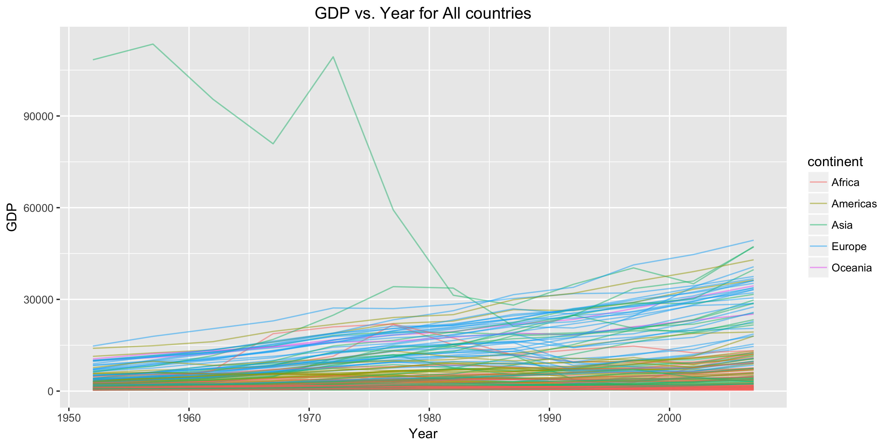
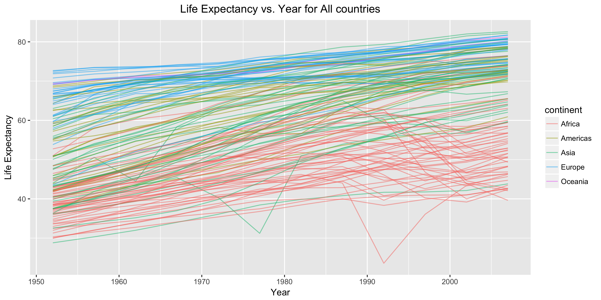
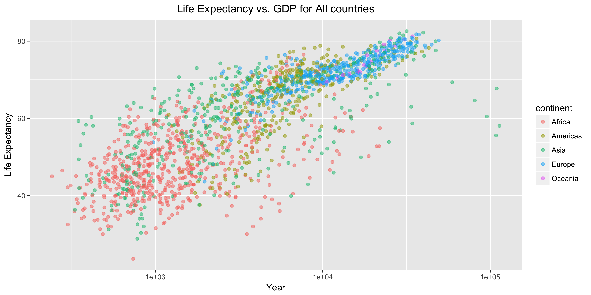
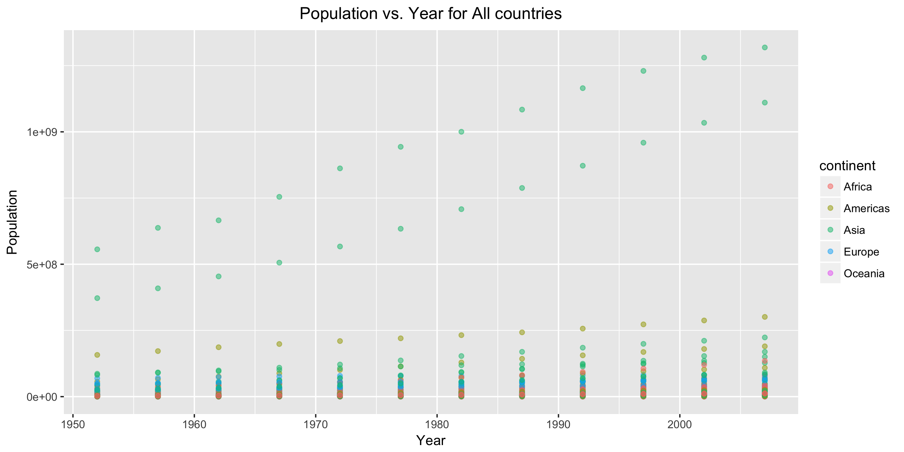
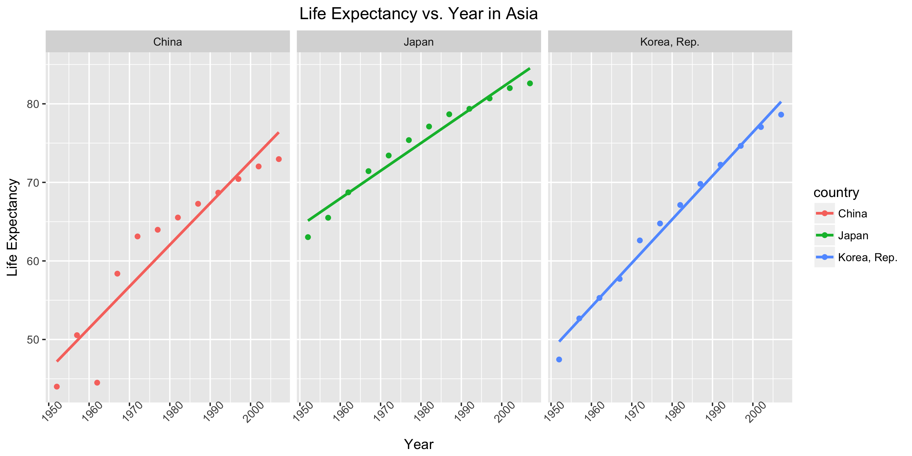
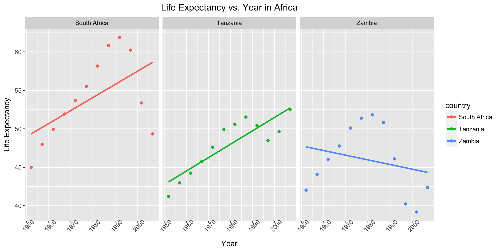
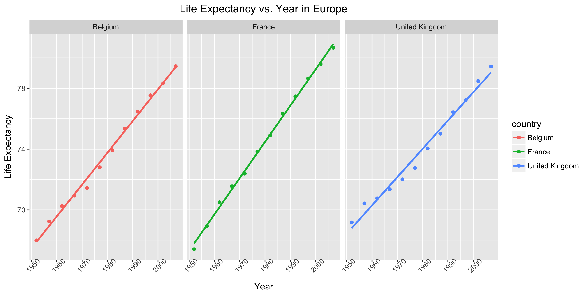
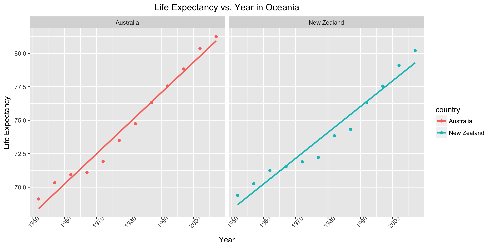
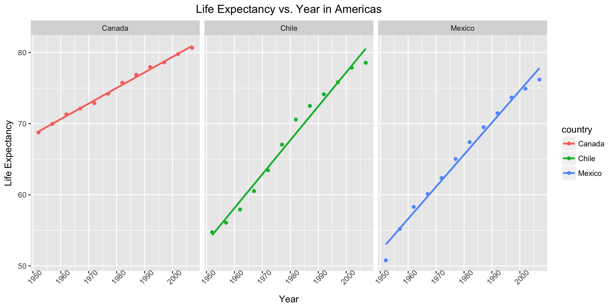

hw07\_report
================
Qiaoyue Tang
2017/11/13

Original Data
=============

Here is a brief look at the original gapminder dataset downloaded from github. It is a large dataframe that contains information like life expectancies, population and gdp recorded throughout 1952~2007 for a lot of countries across the 5 continents.

``` r
gapminder <- read.delim("gapminder.tsv")
head(gapminder)
```

    ##       country continent year lifeExp      pop gdpPercap
    ## 1 Afghanistan      Asia 1952  28.801  8425333  779.4453
    ## 2 Afghanistan      Asia 1957  30.332  9240934  820.8530
    ## 3 Afghanistan      Asia 1962  31.997 10267083  853.1007
    ## 4 Afghanistan      Asia 1967  34.020 11537966  836.1971
    ## 5 Afghanistan      Asia 1972  36.088 13079460  739.9811
    ## 6 Afghanistan      Asia 1977  38.438 14880372  786.1134

``` r
str(gapminder)
```

    ## 'data.frame':    1704 obs. of  6 variables:
    ##  $ country  : Factor w/ 142 levels "Afghanistan",..: 1 1 1 1 1 1 1 1 1 1 ...
    ##  $ continent: Factor w/ 5 levels "Africa","Americas",..: 3 3 3 3 3 3 3 3 3 3 ...
    ##  $ year     : int  1952 1957 1962 1967 1972 1977 1982 1987 1992 1997 ...
    ##  $ lifeExp  : num  28.8 30.3 32 34 36.1 ...
    ##  $ pop      : int  8425333 9240934 10267083 11537966 13079460 14880372 12881816 13867957 16317921 22227415 ...
    ##  $ gdpPercap: num  779 821 853 836 740 ...

Descriptive plots
=================

This section presents some descriptive plots that give an idea of the structure and relationships in the gapminder dataset.









Creating a subset of dataset of interest
========================================

This section creates a second dataset: gapminder2.tsv for which we are going to investigate further later. First we want to reorder the continents based on increasing life expectancies.

``` r
(old_levels <- levels(gapminder$continent))
```

    ## [1] "Africa"   "Americas" "Asia"     "Europe"   "Oceania"

``` r
(new_levels <- fct_reorder(gapminder$continent, gapminder$lifeExp, fun = max, desc = F) %>% 
  levels())
```

    ## [1] "Africa"   "Americas" "Oceania"  "Europe"   "Asia"

Next we want to sort the actual data in a deliberate fashion using new levels of continent. We create a subset of the original data and call it gapminder2. It contains less information than the original dataset so it's easier to present the results in the following sections. Here we create a new column called food that map countries to its setrotype food. The code is taken from my previous homework.

``` r
gapminder2 <- gapminder %>%
  mutate(continent = factor(as.character(continent), new_levels),
         food = fct_recode(country, 
                           "Sushi" = "Japan",
                           "DimSum" = "China",
                           "Poutine" = "Canada",
                           "Chili" = "Chile",
                           "Fish&Chips" = "United Kingdom",
                           "Wine" = "France",
                           "Chocolate" = "Belgium",
                           "Taco" = "Mexico",
                           "Kimchi" = "Korea, Rep.",
                           "Porridge" = "Zambia",
                           "Boerewors" = "South Africa",
                           "Chapati" = "Tanzania",
                           "Milk" = "New Zealand",
                           "kangaroo" = "Australia")) %>%
  filter(country %in% c("Japan", "Canada", "United Kingdom", "Mexico", "Korea, Rep.",
                        "China","Chile","France","Belgium","Zambia","South Africa",
                        "Tanzania","New Zealand","Australia")) %>%
  arrange(lifeExp) %>%
  droplevels()
head(gapminder2)
```

    ##    country continent year lifeExp      pop gdpPercap     food
    ## 1   Zambia    Africa 2002  39.193 10595811 1071.6139 Porridge
    ## 2   Zambia    Africa 1997  40.238  9417789 1071.3538 Porridge
    ## 3 Tanzania    Africa 1952  41.215  8322925  716.6501  Chapati
    ## 4   Zambia    Africa 1952  42.038  2672000 1147.3888 Porridge
    ## 5   Zambia    Africa 2007  42.384 11746035 1271.2116 Porridge
    ## 6 Tanzania    Africa 1957  42.974  9452826  698.5356  Chapati

``` r
str(gapminder2)
```

    ## 'data.frame':    168 obs. of  7 variables:
    ##  $ country  : Factor w/ 14 levels "Australia","Belgium",..: 14 14 12 14 14 12 5 14 12 5 ...
    ##  $ continent: Factor w/ 5 levels "Africa","Americas",..: 1 1 1 1 1 1 5 1 1 5 ...
    ##  $ year     : int  2002 1997 1952 1952 2007 1957 1952 1957 1962 1962 ...
    ##  $ lifeExp  : num  39.2 40.2 41.2 42 42.4 ...
    ##  $ pop      : int  10595811 9417789 8322925 2672000 11746035 9452826 556263527 3016000 10863958 665770000 ...
    ##  $ gdpPercap: num  1072 1071 717 1147 1271 ...
    ##  $ food     : Factor w/ 14 levels "kangaroo","Chocolate",..: 14 14 12 14 14 12 5 14 12 5 ...

Statistical Results
===================

In this section, we first fit some linear regressions for life expectancies on year for a selected number of countries. The result of lm output including the estimates of intercept and slope and the standard errors are stored in a tsv file.

``` r
# Make sure your new continent order is still in force.
(levels(gapminder2$continent))
```

    ## [1] "Africa"   "Americas" "Oceania"  "Europe"   "Asia"

``` r
# Fit a linear regression of life expectancy on year within selected countries. 
model.k <- lm(lifeExp~year, data = gapminder2, subset = (country == "Korea, Rep."))
df1 <- tidy(model.k)
model.j <- lm(lifeExp~year, data = gapminder2, subset = (country == "Japan"))
df2 <- tidy(model.j)
model.c <- lm(lifeExp~year, data = gapminder2, subset = (country == "Canada"))
df3 <- tidy(model.c)
model.uk <- lm(lifeExp~year, data = gapminder2, subset = (country == "United Kingdom"))
df4 <- tidy(model.uk)
model.m <- lm(lifeExp~year, data = gapminder2, subset = (country == "Mexico"))
df5 <- tidy(model.m)

result <- read.delim("lm_info.tsv")
knitr::kable(result)
```

country.intercept.estimate.intercept.se.slope.estimate.slope.se
---------------------------------------------------------------

1 Korea, Rep. -1034.4133 38.8769206432731 0.555400000000002 0.0196390213819123
2 Japan -623.74693892774 45.331372001591 0.352904195804197 0.0228995447499443
3 Canada -358.348892307693 8.25213234921791 0.218869230769231 0.00416863786974605
4 United Kingdom -294.196587645689 14.6376834489753 0.185965734265735 0.00739435566087793 5 Mexico -827.414879953383 34.6006905129103 0.451034965034966 0.0174788457925242

We also select the "best" country in terms of the longest life expectancies for each continent, and the result is shown below.

``` r
continent <- c("Asia","Europe","Africa","Americas","Oceania")
for (i in continent) {
  tmp <- gapminder2 %>%
    filter(continent == i) %>%
    arrange(desc(lifeExp))
    print(list("country_max_lifeExp"=tmp[1, ]$country, 
               "continent"=tmp[1, ]$continent, 
               "max_lifeExp"=tmp[1, ]$lifeExp))
}
```

    ## $country_max_lifeExp
    ## [1] Japan
    ## 14 Levels: Australia Belgium Canada Chile China France ... Zambia
    ## 
    ## $continent
    ## [1] Asia
    ## Levels: Africa Americas Oceania Europe Asia
    ## 
    ## $max_lifeExp
    ## [1] 82.603
    ## 
    ## $country_max_lifeExp
    ## [1] France
    ## 14 Levels: Australia Belgium Canada Chile China France ... Zambia
    ## 
    ## $continent
    ## [1] Europe
    ## Levels: Africa Americas Oceania Europe Asia
    ## 
    ## $max_lifeExp
    ## [1] 80.657
    ## 
    ## $country_max_lifeExp
    ## [1] South Africa
    ## 14 Levels: Australia Belgium Canada Chile China France ... Zambia
    ## 
    ## $continent
    ## [1] Africa
    ## Levels: Africa Americas Oceania Europe Asia
    ## 
    ## $max_lifeExp
    ## [1] 61.888
    ## 
    ## $country_max_lifeExp
    ## [1] Canada
    ## 14 Levels: Australia Belgium Canada Chile China France ... Zambia
    ## 
    ## $continent
    ## [1] Americas
    ## Levels: Africa Americas Oceania Europe Asia
    ## 
    ## $max_lifeExp
    ## [1] 80.653
    ## 
    ## $country_max_lifeExp
    ## [1] Australia
    ## 14 Levels: Australia Belgium Canada Chile China France ... Zambia
    ## 
    ## $continent
    ## [1] Oceania
    ## Levels: Africa Americas Oceania Europe Asia
    ## 
    ## $max_lifeExp
    ## [1] 81.235

Figures
=======

In this section we presents the scatterplots of life expectancies vs. year for each continent, facetting on country. A linear regression line is also included in the plot. We can see that all these countries show an overall increasing patterns of life expectancies as year increases except Zambia.










