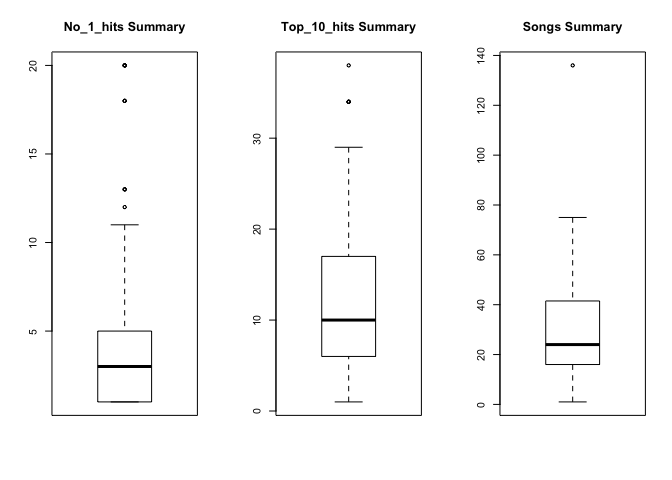

hw10
================
Qiaoyue Tang
November 29, 2017

Scrape data
-----------

I want to extract some information from the following link:

``` r
my_url <- "https://www.billboard.com/charts/greatest-billboard-200-albums#"
page_title <- read_html(my_url)
```

I write three functions to extract the 1) Album name, 2) Artist name, 3) Rank among the greatest 200 albums ranked by billboard and 4) The artist's profile link. The extracted data are put into a dataframe.

In order to correctly extract the link, I used some `stringr` functions to manipulate the patterns.

``` r
get_album <- function(my_link) {
  my_link %>% 
    read_html() %>% 
    html_nodes(css = ".chart-row__song") %>% 
    html_text() %>% 
    return()
}

get_artist <- function(my_link) {
  my_link %>% 
    read_html() %>% 
    html_nodes(css = ".chart-row__artist") %>% 
    html_text() %>%
    str_trim(side = "both") %>% 
    return()
}

get_rank <- function(my_link) {
  my_link %>% 
    read_html() %>% 
    html_nodes(css = ".chart-row__current-week") %>% 
    html_text() %>% 
    return()
}

Album <- get_album(my_url)
Artist <- get_artist(my_url)
Rank <- get_rank(my_url)

df <- data_frame(Rank = Rank,
                 Album = Album,
                 Artist = Artist,
                 Link = glue("https://www.billboard.com/music/{Artist}") %>% 
                   str_to_lower() %>% 
                   str_replace_all(" ","-") %>% 
                   str_replace_all("&","") %>% 
                   str_replace_all("'","") %>% 
                   str_replace_all("--","-") %>% 
                   str_replace_all(",","") %>% 
                   str_replace_all("!",""))
```

Link number 24 is a special case where the artist's name is `M.C. Hammer`, and the link ends with `mc-hammer`. Even though there are options in `stringr` to change this, it is more convenient to modify this one link by hand.

``` r
df$Link[24] <- "https://www.billboard.com/music/mc-hammer"
```

Next, we want to extract some statistics inside each artist's profile page. The statistics include 1) the number of No.1 hits for this artist, 2) the number of top-10 hits for this artist and 3) number of songs recorded for this artist by billboard.

``` r
get_stats <- function(link) {
  link %>% 
    read_html() %>% 
    html_nodes(css = ".artist-section--chart-history__stats__stat--number") %>% 
    html_text() %>% 
    return()
}
```

Since some of the pages are not found in billboard, I used possibly to handle these missing information. Statistics are then extracted from each artist.

``` r
get_stats_safe <- purrr::possibly(get_stats, "None available")

df <- df %>% 
  mutate(Stats = map(Link, get_stats_safe))
```

Since the three statistics are combined into one vector on the billboard page, it would be more convenient to seperate them into three columns for downstram analysis. The cleaned dataframe is called df\_clean.

``` r
No_1_hits <- c()
for (i in 1:200) {
  No_1_hits[i] <- df$Stats[[i]][1]
}

Top_10_hits <- c()
for(i in 1:200) {
  Top_10_hits[i] <- df$Stats[[i]][2]
}

Songs <- c()
for(i in 1:200) {
  Songs[i] <- df$Stats[[i]][3]
}

df_clean <- data_frame(Rank = Rank,
                 Album = Album,
                 Artist = Artist,
                 Link = glue("https://www.billboard.com/music/{Artist}") %>% 
                   str_to_lower() %>% 
                   str_replace_all(" ","-") %>% 
                   str_replace_all("&","") %>% 
                   str_replace_all("'","") %>% 
                   str_replace_all("--","-") %>% 
                   str_replace_all(",","") %>% 
                   str_replace_all("!",""),
                 No_1_hits = as.numeric(No_1_hits),
                 Top_10_hits = as.numeric(Top_10_hits),
                 Songs = as.numeric(Songs))
write_csv(df_clean, "billboard.csv")
```

Analysis on clean dataframe
---------------------------

**For the analysis, I omitted rows with artist named as "Soundtrack". This is because it is not a proper artist name, and the corresponding album is either from a TV show or movie, instead of coming from a specific artist.**

``` r
omit.na.df <- data.frame(na.omit(df_clean))
omit.na.df<-omit.na.df[omit.na.df$Artist != "Soundtrack", ]
```

We can give summary statsitics for the three variables: No.1 hits, top-10 hits and number of songs. A boxplot is plotted for each variable to help visualize.

``` r
summary(omit.na.df$No_1_hits)
```

    ##    Min. 1st Qu.  Median    Mean 3rd Qu.    Max. 
    ##   1.000   1.000   3.000   4.862   5.000  20.000

``` r
summary(omit.na.df$Top_10_hits)
```

    ##    Min. 1st Qu.  Median    Mean 3rd Qu.    Max. 
    ##     1.0     6.0    10.0    12.5    17.0    38.0

``` r
summary(omit.na.df$Songs)
```

    ##    Min. 1st Qu.  Median    Mean 3rd Qu.    Max. 
    ##    1.00   16.00   24.00   31.09   41.50  136.00

``` r
par(mfrow = c(1,3))
boxplot(omit.na.df$No_1_hits, main = "No_1_hits Summary")
boxplot(omit.na.df$Top_10_hits, main = "Top_10_hits Summary")
boxplot(omit.na.df$Songs, main = "Songs Summary")
```



Histograms of No.1 hits, top-10 hits and number of songs scores are plotted respectively. I also computted the maximum No.1 hits, top-10 hits and number of songs, and found out which artist/album had the highest score for each maxima.

``` r
ggplot(data=omit.na.df, aes(omit.na.df$No_1_hits)) + 
  geom_histogram(fill = "skyblue2") +
  ggtitle("Histogram of No.1 Hits for Best 200 Albums") +
  theme(plot.title = element_text(hjust = 0.5))
```

    ## `stat_bin()` using `bins = 30`. Pick better value with `binwidth`.


``` r
omit.na.df$Artist[which.max(omit.na.df$No_1_hits)]
```

    ## [1] "The Beatles"

``` r
omit.na.df$Album[which.max(omit.na.df$No_1_hits)]
```

    ## [1] "Sgt. Pepper's Lonely Hearts Club Band"

``` r
omit.na.df$Rank[which.max(omit.na.df$No_1_hits)]
```

    ## [1] "54"

The Beatles has the most No.1 hits, and the corresponding best album is Sgt. Pepper's Lonely Hearts Club Band which ranked 54 in the billboard's best 200 albums.

``` r
ggplot(data=omit.na.df, aes(omit.na.df$Top_10_hits)) + 
  geom_histogram(fill = "skyblue2") +
  ggtitle("Histogram of Top 10 Hits for Best 200 Albums") +
  theme(plot.title = element_text(hjust = 0.5))
```

    ## `stat_bin()` using `bins = 30`. Pick better value with `binwidth`.


``` r
omit.na.df$Artist[which.max(omit.na.df$Top_10_hits)]
```

    ## [1] "Madonna"

``` r
omit.na.df$Album[which.max(omit.na.df$Top_10_hits)]
```

    ## [1] "True Blue"

``` r
omit.na.df$Rank[which.max(omit.na.df$Top_10_hits)]
```

    ## [1] "179"

Madonna has the most top-10 hits, and the corresponding best album is True Blue which ranked 179 in the billboard's best 200 albums.

``` r
ggplot(data=omit.na.df, aes(omit.na.df$Songs)) + 
  geom_histogram(fill = "skyblue2") +
  ggtitle("Histogram of Number of Songs Included in Billboard") +
  theme(plot.title = element_text(hjust = 0.5))
```

    ## `stat_bin()` using `bins = 30`. Pick better value with `binwidth`.


``` r
omit.na.df$Artist[which.max(omit.na.df$Songs)]
```

    ## [1] "Lil Wayne"

Lil Wayne has the greatest number of songs recorded by billboard.
